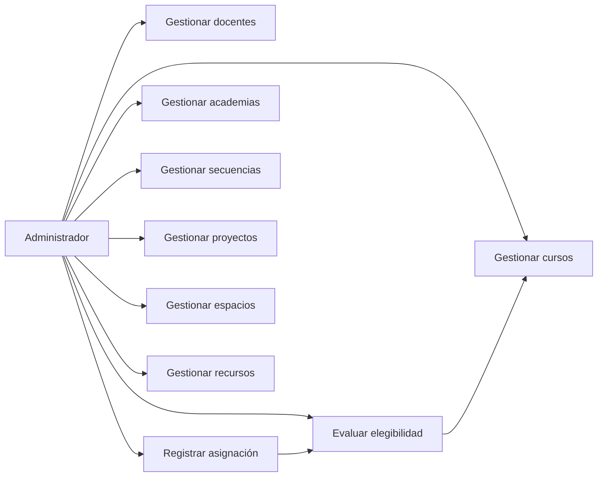
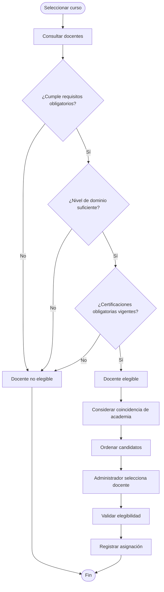
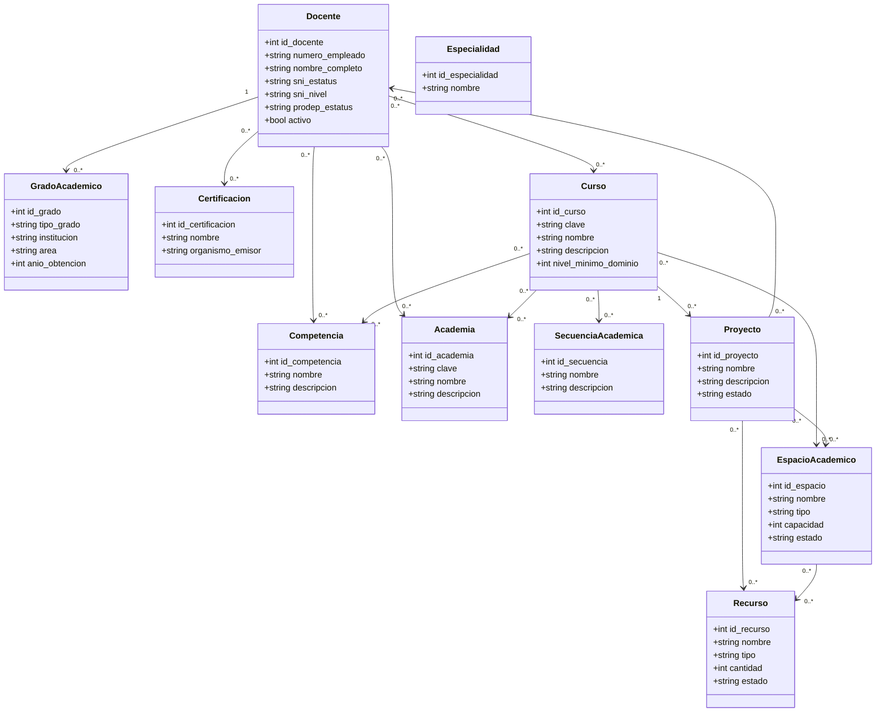

# Levantamiento de Requerimientos de Software
## Sistema de Gestión de Información Académica y Profesional de Docentes
### Proyecto: Desarrollo Rápido de Aplicaciones (RAD)

---
# 1. Resumen del Sistema

El sistema propuesto es una aplicación de gestión de información de docentes, cuyo propósito es centralizar los datos académicos, profesionales y administrativos del personal docente para apoyar procesos de asignación de cursos, secuencias académicas, proyectos, academias, aulas y laboratorios.

El sistema no realizará asignaciones automáticas de docentes. Su función principal será proporcionar información estructurada y realizar una evaluación automática de elegibilidad que permita al administrador identificar qué docentes cumplen con los criterios establecidos para impartir un determinado curso. La decisión final de asignación será realizada manualmente por el administrador.

El sistema permitirá considerar información como grados académicos, especialidad, competencias, certificaciones, SNI/SNII, perfil PRODEP, pertenencia a academias y nivel de dominio de los cursos.

El alcance conceptual cubre siete dominios funcionales:

1. Docentes.
2. Cursos.
3. Secuencias académicas.
4. Proyectos.
5. Academias.
6. Espacios físicos (aulas y laboratorios).
7. Recursos y equipamiento.

La primera versión del sistema contará únicamente con un usuario operativo de tipo **Administrador** y no implementará autenticación.

---

# 2. Alcance

## Incluido

### Gestión de docentes

- Registro y consulta de información de docentes.
- Actualización de información de docentes.
- Búsqueda y filtrado de docentes.
- Registro de grados académicos.
- Registro de certificaciones.
- Registro de competencias y capacidades.
- Registro de especialidad.
- Registro de información de SNI/SNII.
- Registro de información de perfil PRODEP.
- Registro del nivel de dominio de un docente sobre cursos.

### Gestión de cursos

- Registro y consulta de cursos.
- Definición de requisitos de cursos.
- Clasificación de requisitos como obligatorios o recomendados.
- Definición del nivel mínimo de dominio requerido.
- Determinación automática de docentes elegibles.
- Consulta de candidatos para impartir un curso.
- Registro manual de asignaciones docente-curso.

### Gestión de academias

- Registro de academias.
- Asociación de docentes con academias.
- Asociación de cursos con academias.
- Consulta de integrantes y cursos asociados.

### Gestión de secuencias académicas

- Registro de secuencias.
- Asociación de cursos.
- Definición del orden de los cursos.
- Definición de relaciones de precedencia entre cursos.

### Gestión de proyectos académicos

- Registro de proyectos.
- Asociación obligatoria de un proyecto con un curso.
- Asociación de docentes participantes.
- Designación de un docente responsable.
- Asociación de espacios físicos.
- Asociación de recursos y equipamiento.

### Gestión de espacios físicos

- Registro de aulas y laboratorios.
- Registro de capacidad.
- Registro de estado.
- Registro de equipamiento y recursos disponibles.
- Asociación de cursos y proyectos con espacios.

### Gestión de recursos

- Registro de recursos y equipamiento.
- Control de cantidad.
- Asociación de recursos con espacios.
- Asociación de recursos con proyectos.

### Diseño

- Generación de diagramas Mermaid del modelo conceptual.
- Diseño de la interfaz y navegación mediante Excalidraw.

---

## Explícitamente fuera de alcance por ahora

- Gestión de estudiantes como entidad plena.
- Sistema de autenticación e inicio de sesión.
- Administración de múltiples tipos de usuario.
- Sistema de permisos basado en roles.
- Sistema de reservación de horarios de aulas/laboratorios.
- Gestión de horarios y bloques temporales.
- Evaluación docente.
- Nómina o gestión de recursos humanos.
- Notificaciones automáticas.
- Reportes estadísticos avanzados.
- Integración con sistemas externos.
- Asignación automática de docentes.
- Gestión histórica de múltiples periodos escolares.

La primera versión representará únicamente el **estado académico actual**.

---

# 3. Usuario del Sistema

La primera versión del sistema contará con un único usuario operativo:

| Usuario | Estado | Objetivo principal |
|---|---|---|
| Administrador | Confirmado para la primera versión | Gestionar docentes, cursos, academias, secuencias, proyectos, espacios, recursos y asignaciones |

No se implementarán actualmente los roles de Coordinador académico, Jefe de academia o Docente como usuarios independientes del sistema.

El término "Administrador" representa al usuario que opera la aplicación y concentra las funciones necesarias para el prototipo.

## 3.1 Administrador

**Consulta:** toda la información disponible en el sistema.

**Crea:**

- Docentes.
- Grados académicos.
- Certificaciones.
- Competencias.
- Cursos.
- Requisitos.
- Academias.
- Secuencias.
- Proyectos.
- Aulas.
- Laboratorios.
- Recursos.

**Modifica:** cualquier entidad disponible.

**Elimina:** se priorizará la desactivación de registros cuando existan relaciones dependientes, en lugar de eliminar físicamente información que pueda afectar la integridad del sistema.

**Restricciones:** no existen restricciones funcionales dentro del sistema para esta primera versión.

### Autenticación

No se implementará autenticación en la primera versión.

El sistema asumirá que el usuario que accede a la aplicación es el administrador autorizado.

La implementación de usuarios, contraseñas, sesiones y permisos queda fuera del alcance actual.

---

# 4. Requerimientos Funcionales

## Gestión de docentes

### RF-001 — Registrar docente

**Descripción:** El sistema deberá permitir al administrador registrar un docente capturando número de empleado, nombre completo, especialidad, grados académicos, información de SNI/SNII, perfil PRODEP y certificaciones.

**Actor responsable:** Administrador.

**Prioridad:** Alta.

**Datos involucrados:** entidad Docente y entidades relacionadas.

**Precondiciones:** ninguna relacionada con autenticación.

**Resultado esperado:** el docente queda registrado y disponible para su asociación con cursos, proyectos y academias.

---

### RF-002 — Consultar docente

**Descripción:** El sistema deberá permitir consultar la información completa de un docente, incluyendo su perfil académico y profesional.

**Actor:** Administrador.

**Prioridad:** Alta.

---

### RF-003 — Actualizar información de docente

**Descripción:** El sistema deberá permitir modificar los datos de un docente previamente registrado.

**Actor:** Administrador.

**Prioridad:** Alta.

---

### RF-004 — Buscar y filtrar docentes

**Descripción:** El sistema deberá permitir buscar y filtrar docentes utilizando criterios como:

- Número de empleado.
- Nombre.
- Especialidad.
- Grado académico.
- Certificación.
- Competencia.
- Academia.
- Curso.

**Actor:** Administrador.

**Prioridad:** Alta.

---

### RF-005 — Consultar grados académicos de un docente

**Descripción:** El sistema deberá permitir consultar los grados académicos asociados a un docente, incluyendo licenciatura, maestría y doctorado.

**Prioridad:** Media.

---

### RF-006 — Consultar certificaciones de un docente

**Descripción:** El sistema deberá permitir consultar las certificaciones asociadas a un docente, incluyendo su vigencia cuando corresponda.

**Prioridad:** Media.

---

### RF-007 — Consultar SNI/SNII y PRODEP

**Descripción:** El sistema deberá permitir consultar el estatus de SNI/SNII y perfil PRODEP de un docente.

Para SNI/SNII se podrá almacenar:

- Estatus.
- Nivel.
- Área, cuando corresponda.
- Fecha de inicio de vigencia.
- Fecha de fin de vigencia.

Para PRODEP se podrá almacenar:

- Estatus.
- Tipo o modalidad.
- Fecha de inicio de vigencia.
- Fecha de fin de vigencia.

**Prioridad:** Media.

---

### RF-008 — Asociar competencias/capacidades con un docente

**Descripción:** El sistema deberá permitir asociar una o más competencias o capacidades a un docente.

Las competencias serán registradas de manera explícita y podrán utilizarse como requisitos para los cursos.

**Actor:** Administrador.

**Prioridad:** Alta.

---

### RF-009 — Registrar nivel de dominio de un docente sobre un curso

**Descripción:** El sistema deberá permitir registrar el nivel de dominio de un docente sobre un curso en una escala de 0 a 10.

El nivel será capturado manualmente por el administrador.

**Actor:** Administrador.

**Prioridad:** Alta.

---

## Gestión de cursos

### RF-010 — Registrar curso

**Descripción:** El sistema deberá permitir registrar un curso o asignatura con su nombre, clave, descripción y nivel mínimo de dominio requerido.

**Actor:** Administrador.

**Prioridad:** Alta.

---

### RF-011 — Definir requisitos de un curso

**Descripción:** El sistema deberá permitir definir las competencias necesarias para impartir un curso, diferenciando entre:

- Requisitos obligatorios.
- Requisitos recomendados.

También deberá permitir establecer el nivel mínimo de dominio requerido para el curso.

**Actor:** Administrador.

**Prioridad:** Alta.

---

### RF-012 — Consultar candidatos elegibles para un curso

**Descripción:** El sistema deberá permitir consultar la lista de docentes que cumplen los requisitos obligatorios de un curso determinado.

La lista podrá mostrar:

- Nivel de dominio.
- Especialidad.
- Grados académicos.
- Competencias.
- Certificaciones.
- Academia o academias a las que pertenece.
- SNI/SNII.
- PRODEP.

**Prioridad:** Alta.

---

### RF-013 — Determinar elegibilidad de un docente para un curso

**Descripción:** El sistema deberá determinar automáticamente si un docente cumple las condiciones necesarias para impartir un curso.

Un docente será considerado elegible cuando:

1. Cumpla todos los requisitos obligatorios.
2. Su nivel de dominio sea igual o superior al nivel mínimo requerido por el curso.
3. Las certificaciones obligatorias requeridas se encuentren vigentes.

**Prioridad:** Alta.

---

### RF-014 — Registrar asignación de docente a curso

**Descripción:** El sistema deberá permitir al administrador registrar manualmente la asignación de un docente a un curso después de consultar los candidatos elegibles.

El sistema deberá validar nuevamente que el docente cumpla los requisitos obligatorios antes de registrar la asignación.

**Prioridad:** Alta.

---

## Gestión de secuencias académicas

### RF-015 — Registrar secuencia académica

**Descripción:** El sistema deberá permitir crear una secuencia académica compuesta por un conjunto ordenado de cursos.

**Prioridad:** Media.

---

### RF-016 — Definir relaciones de precedencia entre cursos

**Descripción:** El sistema deberá permitir establecer el orden y las relaciones de precedencia entre cursos dentro de una secuencia académica.

**Prioridad:** Media.

---

### RF-017 — Consultar secuencia académica

**Descripción:** El sistema deberá permitir consultar los cursos que componen una secuencia y su orden correspondiente.

**Prioridad:** Media.

---

## Gestión de proyectos académicos

### RF-018 — Registrar proyecto académico

**Descripción:** El sistema deberá permitir registrar un proyecto académico asociado obligatoriamente a un curso.

El proyecto podrá contener:

- Nombre.
- Descripción.
- Estado.
- Curso asociado.
- Docente responsable.
- Docentes participantes.
- Espacios físicos.
- Recursos requeridos.

**Prioridad:** Media.

---

### RF-019 — Asignar docente responsable a un proyecto

**Descripción:** El sistema deberá permitir designar un docente responsable para un proyecto registrado.

Cada proyecto deberá tener exactamente un docente responsable.

**Prioridad:** Media.

---

### RF-020 — Asociar docentes participantes a un proyecto

**Descripción:** El sistema deberá permitir asociar uno o varios docentes participantes a un proyecto.

Un docente podrá participar en múltiples proyectos.

**Prioridad:** Media.

---

### RF-021 — Asociar recursos y espacio físico a un proyecto

**Descripción:** El sistema deberá permitir asociar uno o varios espacios académicos, así como recursos y equipamiento, a un proyecto.

**Prioridad:** Media.

---

## Gestión de academias

### RF-022 — Registrar academia

**Descripción:** El sistema deberá permitir registrar una academia con:

- Nombre.
- Clave.
- Descripción.
- Estado.

La clave de la academia será alfanumérica, tendrá una longitud máxima de 10 caracteres y deberá ser única.

**Prioridad:** Media.

---

### RF-023 — Asociar docente con academia

**Descripción:** El sistema deberá permitir asociar uno o más docentes a una academia.

Un docente podrá pertenecer a una o varias academias.

**Prioridad:** Media.

---

### RF-024 — Consultar academias de un docente

**Descripción:** El sistema deberá permitir consultar a qué academia o academias pertenece un docente.

**Prioridad:** Media.

---

### RF-025 — Asociar cursos con academias

**Descripción:** El sistema deberá permitir asociar cursos a una o varias academias cuando corresponda.

La coincidencia entre la academia del curso y la academia del docente podrá utilizarse como criterio de recomendación durante la consulta de candidatos.

**Prioridad:** Media.

---

## Gestión de aulas y laboratorios

### RF-026 — Registrar aula o laboratorio

**Descripción:** El sistema deberá permitir registrar un espacio académico indicando:

- Nombre.
- Tipo.
- Capacidad.
- Estado.
- Recursos/equipamiento disponible.

Los tipos de espacio serán:

- Aula.
- Laboratorio.

**Prioridad:** Media.

---

### RF-027 — Consultar disponibilidad general de espacios

**Descripción:** El sistema deberá permitir consultar qué espacios se encuentran disponibles o no disponibles para su asociación con cursos o proyectos.

En esta versión, la disponibilidad será general y no estará relacionada con horarios específicos.

**Prioridad:** Media.

---

### RF-028 — Asociar cursos/proyectos con espacios físicos

**Descripción:** El sistema deberá permitir vincular uno o varios cursos o proyectos con los espacios académicos requeridos.

Esta asociación no representa una reservación de horario.

**Prioridad:** Media.

---

## Gestión de recursos y equipamiento

### RF-029 — Registrar recurso o equipamiento

**Descripción:** El sistema deberá permitir registrar recursos o equipamiento indicando:

- Nombre.
- Tipo.
- Cantidad.
- Estado.

**Prioridad:** Media.

---

### RF-030 — Asociar recursos a espacios académicos

**Descripción:** El sistema deberá permitir asociar recursos a aulas o laboratorios, indicando la cantidad disponible.

**Prioridad:** Media.

---

### RF-031 — Asociar recursos a proyectos

**Descripción:** El sistema deberá permitir asociar recursos a proyectos, indicando la cantidad requerida.

**Prioridad:** Media.

---

# 5. Requerimientos No Funcionales

## 5.1 Derivados directamente del contexto

### RNF-001 — Integridad de datos

El sistema deberá garantizar que un docente no pueda ser considerado elegible para un curso sin cumplir los requisitos obligatorios definidos y el nivel mínimo de dominio establecido.

---

### RNF-002 — Consistencia de relaciones

El sistema deberá mantener la integridad de las relaciones entre docentes, cursos, academias, proyectos, espacios y recursos.

No deberán generarse asociaciones duplicadas ni referencias a entidades inexistentes.

---

### RNF-003 — Validación de datos

El sistema deberá validar los datos ingresados, incluyendo:

- Unicidad del número de empleado.
- Unicidad de la clave del curso.
- Unicidad de la clave de academia.
- Nivel de dominio entre 0 y 10.
- Capacidad de espacios mayor que cero.
- Fechas de certificación válidas.
- Claves de academia con máximo 10 caracteres alfanuméricos.

---

## 5.2 Recomendados

### RNF-004 — Usabilidad

Se recomienda una interfaz simple y consistente, dado el contexto de un proyecto académico RAD con tiempo de desarrollo limitado.

La navegación deberá organizarse mediante módulos claramente identificables.

---

### RNF-005 — Mantenibilidad

Se recomienda una arquitectura modular que separe las principales áreas funcionales:

- Docentes.
- Cursos.
- Academias.
- Secuencias.
- Proyectos.
- Espacios.
- Recursos.

---

### RNF-006 — Respaldos

Se recomienda realizar respaldos periódicos de la base de datos, especialmente antes de demostraciones o modificaciones importantes.

La frecuencia exacta no será una funcionalidad del sistema y dependerá del entorno de desarrollo.

---

### RNF-007 — Rendimiento

Para el prototipo se establece como objetivo que las consultas comunes respondan en aproximadamente 2 segundos o menos bajo un volumen esperado de hasta:

- 500 docentes.
- 200 cursos.
- 50 academias.
- 100 espacios académicos.

---

### RNF-008 — Disponibilidad

No se establecerá un SLA formal.

La aplicación estará orientada inicialmente a un entorno académico, de desarrollo y demostración.

---

### RNF-009 — Escalabilidad

La arquitectura deberá mantenerse modular para permitir una ampliación futura del sistema, aunque no se establece como requisito una infraestructura de escalabilidad empresarial para la primera versión.

---

### RNF-010 — Privacidad

El sistema almacenará únicamente información académica y profesional necesaria para sus funciones.

No se almacenarán contraseñas, información bancaria, médica u otra información personal sensible que no sea necesaria para el objetivo del sistema.

La implementación de políticas institucionales específicas de protección de datos queda fuera del alcance técnico del prototipo.

---

# 6. Reglas de Negocio

| ID | Regla | Tipo |
|---|---|---|
| RN-001 | Un docente solo podrá ser considerado elegible para impartir un curso cuando cumpla todos los requisitos obligatorios definidos para dicho curso. | Regla de negocio |
| RN-002 | El nivel de dominio de un docente sobre un curso deberá encontrarse entre 0 y 10. | Regla de negocio |
| RN-003 | Un docente será elegible cuando su nivel de dominio sea igual o superior al nivel mínimo requerido por el curso. | Regla de negocio |
| RN-004 | Las certificaciones que sean requisitos obligatorios deberán encontrarse vigentes para que puedan considerarse cumplidas. | Regla de negocio |
| RN-005 | Los requisitos recomendados no impedirán que un docente sea considerado elegible. | Regla de negocio |
| RN-006 | La coincidencia entre la academia del docente y la academia asociada al curso será un criterio de recomendación, no un requisito obligatorio. | Regla de negocio |
| RN-007 | Un docente puede pertenecer a una o varias academias. | Regla estructural |
| RN-008 | Un curso puede estar asociado a una o varias academias. | Regla estructural |
| RN-009 | La elegibilidad se determinará automáticamente mediante las reglas establecidas. | Regla funcional |
| RN-010 | La asignación final de un docente a un curso será realizada manualmente por el administrador. | Regla funcional |
| RN-011 | El sistema no permitirá registrar una asignación docente-curso si el docente no cumple los requisitos obligatorios. | Regla de integridad |
| RN-012 | Un docente puede tener cero o más certificaciones. | Regla estructural |
| RN-013 | Un docente puede tener cero o más grados académicos registrados. | Regla estructural |
| RN-014 | Un proyecto académico pertenece obligatoriamente a un único curso. | Regla estructural |
| RN-015 | Un proyecto deberá tener exactamente un docente responsable. | Regla de negocio |
| RN-016 | Un proyecto puede tener cero o varios docentes participantes adicionales. | Regla estructural |
| RN-017 | Un curso puede tener cero o varios proyectos asociados. | Regla estructural |
| RN-018 | Un curso puede pertenecer a varias secuencias académicas. | Regla estructural |
| RN-019 | Un curso no podrá aparecer más de una vez dentro de la misma secuencia académica. | Regla de integridad |
| RN-020 | La primera versión del sistema manejará únicamente el estado académico actual y no administrará múltiples periodos escolares. | Regla de alcance |
| RN-021 | La disponibilidad de aulas y laboratorios se manejará como estado general y no como disponibilidad por horario. | Regla de alcance |
| RN-022 | Las entidades principales podrán desactivarse en lugar de eliminarse físicamente cuando existan relaciones dependientes. | Regla de integridad |

---

### 7.2 Entidades identificadas

| Entidad | Propósito | Atributos principales | Clave primaria propuesta | Relaciones importantes |
|---|---|---|---|---|
| Docente | Representa al profesor | id_docente, numero_empleado, nombre_completo, especialidad_id, SNI/SNII, PRODEP | id_docente | GradoAcadémico, Certificación, Competencia, Curso, Academia, Proyecto |
| GradoAcademico | Registra los grados académicos | id_grado, tipo_grado, institucion, area, anio, docente_id | id_grado | Docente (N:1) |
| Especialidad | Catálogo de especialidades | id_especialidad, nombre | id_especialidad | Docente (1:N) |
| Certificacion | Catálogo de certificaciones | id_certificacion, nombre, organismo_emisor, descripcion | id_certificacion | Docente (N:M) |
| DocenteCertificacion | Relaciona docentes y certificaciones | docente_id, certificacion_id, fecha_emision, fecha_vencimiento | Clave compuesta | Docente, Certificacion |
| Competencia | Representa habilidades o capacidades | id_competencia, nombre, descripcion | id_competencia | Docente (N:M), Curso (N:M) |
| DocenteCompetencia | Relaciona docentes y competencias | docente_id, competencia_id | Clave compuesta | Docente, Competencia |
| Curso | Representa una asignatura | id_curso, clave, nombre, descripcion, nivel_minimo_dominio | id_curso | Docente, Competencia, Secuencia, Proyecto, Academia, Espacio |
| DocenteCurso | Registra dominio del docente sobre un curso | docente_id, curso_id, nivel_dominio | Clave compuesta | Docente, Curso |
| CursoRequisito | Define competencias requeridas por curso | curso_id, competencia_id, tipo_requisito | Clave compuesta | Curso, Competencia |
| Academia | Agrupación académica | id_academia, clave, nombre, descripcion | id_academia | Docente (N:M), Curso (N:M) |
| DocenteAcademia | Relaciona docentes y academias | docente_id, academia_id | Clave compuesta | Docente, Academia |
| CursoAcademia | Relaciona cursos y academias | curso_id, academia_id | Clave compuesta | Curso, Academia |
| SecuenciaAcademica | Agrupación ordenada de cursos | id_secuencia, nombre, descripcion | id_secuencia | Curso (N:M) |
| SecuenciaCurso | Relaciona cursos con secuencias | secuencia_id, curso_id, orden | Clave compuesta | Secuencia, Curso |
| Proyecto | Proyecto académico | id_proyecto, nombre, descripcion, curso_id, estado | id_proyecto | Curso, Docente, Espacio, Recurso |
| DocenteProyecto | Relaciona docentes y proyectos | docente_id, proyecto_id, rol | Clave compuesta | Docente, Proyecto |
| EspacioAcademico | Representa aula o laboratorio | id_espacio, nombre, tipo, capacidad, estado | id_espacio | Curso, Proyecto, Recurso |
| CursoEspacio | Relaciona cursos y espacios | curso_id, espacio_id | Clave compuesta | Curso, Espacio |
| ProyectoEspacio | Relaciona proyectos y espacios | proyecto_id, espacio_id | Clave compuesta | Proyecto, Espacio |
| Recurso | Representa recurso o equipamiento | id_recurso, nombre, tipo, cantidad, estado | id_recurso | Espacio, Proyecto |
| EspacioRecurso | Relaciona recursos con espacios | espacio_id, recurso_id, cantidad | Clave compuesta | Espacio, Recurso |
| ProyectoRecurso | Relaciona recursos con proyectos | proyecto_id, recurso_id, cantidad | Clave compuesta | Proyecto, Recurso |

### Nota de diseño

Se utilizará una entidad genérica `EspacioAcademico` en lugar de mantener entidades independientes `Aula` y `Laboratorio`.

El atributo `tipo` permitirá distinguir entre:

- Aula.
- Laboratorio.

Esto evita duplicación estructural y permite que ambas clases de espacio sean utilizadas de la misma manera por cursos y proyectos.

---

## 8. Relaciones y Cardinalidades

| Relación | Cardinalidad | Justificación |
|---|---|---|
| Docente — GradoAcademico | 1:N | Un docente puede tener cero o varios grados académicos; cada grado pertenece a un solo docente. |
| Docente — Certificación | N:M | Un docente puede tener varias certificaciones y una certificación puede estar asociada a varios docentes. Se utiliza `DocenteCertificacion`. |
| Docente — Competencia | N:M | Un docente puede tener varias competencias y una competencia puede corresponder a varios docentes. Se utiliza `DocenteCompetencia`. |
| Docente — Curso | N:M | Un docente puede tener dominio registrado sobre varios cursos y un curso puede tener varios docentes con nivel de dominio registrado. Se utiliza `DocenteCurso`. |
| Docente — Academia | N:M | Un docente puede pertenecer a varias academias y una academia puede tener varios docentes. Se utiliza `DocenteAcademia`. |
| Curso — Competencia | N:M | Un curso puede requerir varias competencias y una competencia puede ser requisito de varios cursos. Se utiliza `CursoRequisito`. |
| Curso — Secuencia | N:M | Un curso puede pertenecer a diferentes secuencias y una secuencia contiene varios cursos. Se utiliza `SecuenciaCurso`, que registra el orden. |
| Curso — Proyecto | 1:N | Un curso puede tener cero o varios proyectos y cada proyecto pertenece a un único curso. |
| Curso — Academia | N:M | Un curso puede estar asociado a varias academias y una academia puede agrupar varios cursos. Se utiliza `CursoAcademia`. |
| Proyecto — Docente | N:M | Un proyecto puede tener varios docentes y un docente puede participar en varios proyectos. Se utiliza `DocenteProyecto`. |
| Curso — EspacioAcademico | N:M | Un curso puede estar asociado a diferentes espacios y un espacio puede estar asociado a diferentes cursos. Se utiliza `CursoEspacio`. |
| Proyecto — EspacioAcademico | N:M | Un proyecto puede utilizar uno o varios espacios y un espacio puede estar asociado a diferentes proyectos. Se utiliza `ProyectoEspacio`. |
| EspacioAcademico — Recurso | N:M | Un espacio puede disponer de varios recursos y un recurso puede encontrarse asociado a diferentes espacios. Se utiliza `EspacioRecurso`. |
| Proyecto — Recurso | N:M | Un proyecto puede requerir varios recursos y un recurso puede ser utilizado por varios proyectos. Se utiliza `ProyectoRecurso`. |

### Aclaración sobre cardinalidades

Las relaciones N:M se implementarán mediante entidades asociativas. Esto permite almacenar información adicional de la relación.

Por ejemplo:

```text
Docente ───< DocenteCurso >─── Curso
                    │
                    └── nivel_dominio
```

El nivel de dominio no pertenece exclusivamente al docente ni exclusivamente al curso; pertenece a la relación entre ambos.

De manera similar:

```text
Docente ───< DocenteAcademia >─── Academia
```

permite que un docente pertenezca a varias academias.


---
# 9. Casos de Uso

## CU-001 — Registrar docente

**Actor principal:** Administrador.

**Objetivo:** Incorporar un nuevo docente al sistema con su información básica.

**Precondiciones:** No requiere autenticación en la primera versión.

**Flujo principal:**

1. El administrador accede al módulo de docentes.
2. Selecciona la opción para registrar un docente.
3. Captura los datos obligatorios.
4. El sistema valida la información.
5. El sistema almacena el registro.
6. El administrador puede agregar grados académicos, certificaciones y competencias.

**Flujos alternativos:**

- El administrador puede registrar primero al docente y posteriormente agregar información relacionada.

**Excepciones:**

- Número de empleado duplicado → el sistema rechaza el registro.

**Resultado esperado:** Docente disponible para asociaciones futuras.

---

## CU-002 — Consultar candidatos elegibles para un curso

**Actor principal:** Administrador.

**Objetivo:** Obtener la lista de docentes que cumplen los requisitos de un curso.

**Precondiciones:** El curso debe estar registrado y contar con la información necesaria para realizar la evaluación.

**Flujo principal:**

1. El administrador selecciona un curso.
2. El sistema consulta los docentes registrados.
3. El sistema evalúa los requisitos obligatorios.
4. El sistema compara el nivel de dominio del docente con el nivel mínimo requerido.
5. El sistema valida las certificaciones obligatorias.
6. El sistema identifica los docentes elegibles.
7. El sistema muestra los candidatos.

**Flujos alternativos:**

- El administrador puede filtrar por academia.
- El administrador puede filtrar por especialidad.
- El administrador puede ordenar por nivel de dominio.

**Excepciones:**

- Ningún docente cumple los requisitos → el sistema informa que no existen candidatos elegibles.

**Resultado esperado:** Lista de docentes elegibles ordenada de acuerdo con los criterios definidos.

---

## CU-003 — Registrar proyecto académico

**Actor principal:** Administrador.

**Objetivo:** Crear un proyecto asociado a un curso, docentes y recursos.

**Precondiciones:**

- Debe existir un curso.
- Debe existir al menos un docente para designarlo como responsable.

**Flujo principal:**

1. El administrador accede al módulo de proyectos.
2. Crea un nuevo proyecto.
3. Selecciona el curso asociado.
4. Designa un docente responsable.
5. Agrega docentes participantes, si corresponde.
6. Asocia espacios.
7. Asocia recursos.
8. El sistema valida la información.
9. El sistema registra el proyecto.

**Excepciones:**

- Falta de curso → el sistema no permite guardar.
- Falta de docente responsable → el sistema no permite guardar.

**Resultado esperado:** Proyecto registrado y disponible para consulta.

---

## CU-004 — Asociar docente a academia

**Actor principal:** Administrador.

**Objetivo:** Incorporar un docente a una academia.

**Precondiciones:**

- El docente debe existir.
- La academia debe existir.

**Flujo principal:**

1. El administrador selecciona una academia.
2. Consulta los docentes.
3. Selecciona un docente.
4. El sistema valida que la relación no exista previamente.
5. El sistema registra la asociación.

**Resultado esperado:** El docente queda asociado a la academia.

---

## CU-005 — Gestionar espacio académico

**Actor principal:** Administrador.

**Objetivo:** Registrar y mantener actualizados los espacios disponibles.

**Precondiciones:** Ninguna.

**Flujo principal:**

1. El administrador accede al módulo de espacios.
2. Selecciona aula o laboratorio.
3. Captura nombre, capacidad y estado.
4. Registra el equipamiento disponible.
5. El sistema valida la información.
6. El sistema almacena el espacio.

**Resultado esperado:** Espacio disponible para su asociación con cursos y proyectos.

---

# 10. Matriz de Trazabilidad Preliminar

| Regla de negocio | Requerimiento funcional | Caso de uso | Entidades involucradas |
|---|---|---|---|
| RN-001 | RF-011, RF-012, RF-013 | CU-002 | Docente, Curso, Competencia |
| RN-002 | RF-009 | CU-002 | Docente, Curso |
| RN-003 | RF-010, RF-013 | CU-002 | Docente, Curso |
| RN-004 | RF-006, RF-011, RF-013 | CU-002 | Docente, Certificacion, Curso |
| RN-005 | RF-011, RF-013 | CU-002 | Curso, Competencia |
| RN-006 | RF-025 | CU-002 | Docente, Academia, Curso |
| RN-007 | RF-023, RF-024 | CU-004 | Docente, Academia |
| RN-008 | RF-025 | CU-002 | Curso, Academia |
| RN-009 | RF-013 | CU-002 | Docente, Curso |
| RN-010 | RF-014 | — | Docente, Curso |
| RN-011 | RF-014 | — | Docente, Curso |
| RN-012 | RF-006 | CU-001 | Docente, Certificacion |
| RN-013 | RF-005 | CU-001 | Docente, GradoAcademico |
| RN-014 | RF-018 | CU-003 | Curso, Proyecto |
| RN-015 | RF-019 | CU-003 | Proyecto, Docente |
| RN-016 | RF-020 | CU-003 | Proyecto, Docente |
| RN-017 | RF-018 | CU-003 | Curso, Proyecto |
| RN-018 | RF-015, RF-016 | — | SecuenciaAcademica, Curso |
| RN-019 | RF-016 | — | SecuenciaAcademica, Curso |
| RN-020 | — | — | Todas las entidades académicas |
| RN-021 | RF-027, RF-028 | CU-005 | EspacioAcademico |
| RN-022 | RF-003, RF-024, RF-027, RF-029 | — | Entidades principales |

---

# 11. Diagramas Mermaid

## A. Diagrama de casos de uso



---

## B. Diagrama entidad-relación conceptual

```mermaid
erDiagram

    DOCENTE ||--o{ GRADO_ACADEMICO : posee

    DOCENTE ||--o{ DOCENTE_CERTIFICACION : tiene
    CERTIFICACION ||--o{ DOCENTE_CERTIFICACION : corresponde

    DOCENTE ||--o{ DOCENTE_COMPETENCIA : posee
    COMPETENCIA ||--o{ DOCENTE_COMPETENCIA : corresponde

    DOCENTE ||--o{ DOCENTE_CURSO : domina
    CURSO ||--o{ DOCENTE_CURSO : tiene

    DOCENTE ||--o{ DOCENTE_ACADEMIA : pertenece
    ACADEMIA ||--o{ DOCENTE_ACADEMIA : integra

    CURSO ||--o{ CURSO_REQUISITO : requiere
    COMPETENCIA ||--o{ CURSO_REQUISITO : define

    CURSO ||--o{ CURSO_ACADEMIA : pertenece
    ACADEMIA ||--o{ CURSO_ACADEMIA : agrupa

    SECUENCIA_ACADEMICA ||--o{ SECUENCIA_CURSO : contiene
    CURSO ||--o{ SECUENCIA_CURSO : participa

    CURSO ||--o{ PROYECTO : origina

    PROYECTO ||--o{ DOCENTE_PROYECTO : involucra
    DOCENTE ||--o{ DOCENTE_PROYECTO : participa

    CURSO ||--o{ CURSO_ESPACIO : utiliza
    ESPACIO_ACADEMICO ||--o{ CURSO_ESPACIO : recibe

    PROYECTO ||--o{ PROYECTO_ESPACIO : utiliza
    ESPACIO_ACADEMICO ||--o{ PROYECTO_ESPACIO : recibe

    ESPACIO_ACADEMICO ||--o{ ESPACIO_RECURSO : dispone
    RECURSO ||--o{ ESPACIO_RECURSO : pertenece

    PROYECTO ||--o{ PROYECTO_RECURSO : requiere
    RECURSO ||--o{ PROYECTO_RECURSO : utiliza

    DOCENTE {
        int id_docente PK
        string numero_empleado UK
        string nombre_completo
        int especialidad_id FK
        string sni_estatus
        string sni_nivel
        string sni_area
        date sni_vigencia_inicio
        date sni_vigencia_fin
        string prodep_estatus
        string prodep_tipo
        date prodep_vigencia_inicio
        date prodep_vigencia_fin
        boolean activo
    }

    GRADO_ACADEMICO {
        int id_grado PK
        int docente_id FK
        string tipo_grado
        string institucion
        string area
        int anio_obtencion
    }

    ESPECIALIDAD {
        int id_especialidad PK
        string nombre UK
    }

    CERTIFICACION {
        int id_certificacion PK
        string nombre
        string organismo_emisor
        string descripcion
    }

    DOCENTE_CERTIFICACION {
        int docente_id FK
        int certificacion_id FK
        date fecha_emision
        date fecha_vencimiento
    }

    COMPETENCIA {
        int id_competencia PK
        string nombre
        string descripcion
    }

    DOCENTE_COMPETENCIA {
        int docente_id FK
        int competencia_id FK
    }

    CURSO {
        int id_curso PK
        string clave UK
        string nombre
        string descripcion
        int nivel_minimo_dominio
        boolean activo
    }

    DOCENTE_CURSO {
        int docente_id FK
        int curso_id FK
        int nivel_dominio
    }

    CURSO_REQUISITO {
        int curso_id FK
        int competencia_id FK
        string tipo_requisito
    }

    ACADEMIA {
        int id_academia PK
        string clave UK
        string nombre
        string descripcion
        boolean activo
    }

    DOCENTE_ACADEMIA {
        int docente_id FK
        int academia_id FK
    }

    CURSO_ACADEMIA {
        int curso_id FK
        int academia_id FK
    }

    SECUENCIA_ACADEMICA {
        int id_secuencia PK
        string nombre
        string descripcion
    }

    SECUENCIA_CURSO {
        int secuencia_id FK
        int curso_id FK
        int orden
    }

    PROYECTO {
        int id_proyecto PK
        int curso_id FK
        string nombre
        string descripcion
        string estado
    }

    DOCENTE_PROYECTO {
        int docente_id FK
        int proyecto_id FK
        string rol
    }

    ESPACIO_ACADEMICO {
        int id_espacio PK
        string nombre
        string tipo
        int capacidad
        string estado
    }

    CURSO_ESPACIO {
        int curso_id FK
        int espacio_id FK
    }

    PROYECTO_ESPACIO {
        int proyecto_id FK
        int espacio_id FK
    }

    RECURSO {
        int id_recurso PK
        string nombre
        string tipo
        int cantidad
        string estado
    }

    ESPACIO_RECURSO {
        int espacio_id FK
        int recurso_id FK
        int cantidad
    }

    PROYECTO_RECURSO {
        int proyecto_id FK
        int recurso_id FK
        int cantidad
    }
```



---

## C. Diagrama de flujo general — Elegibilidad docente-curso



---

## D. Diagrama de clases conceptual



---

# 12. Decisiones de Levantamiento de Requerimientos

Las preguntas que originalmente quedaron pendientes han sido resueltas para esta versión del proyecto:

| Pregunta original | Decisión adoptada |
|---|---|
| ¿Quién puede registrar docentes? | Únicamente el Administrador. |
| ¿Quién puede modificar SNI y PRODEP? | El Administrador. |
| ¿Qué significa que un docente esté capacitado? | Cumplir los requisitos obligatorios y alcanzar el nivel mínimo de dominio establecido para el curso. |
| ¿La elegibilidad es automática o manual? | Automática mediante reglas definidas. |
| ¿La asignación es automática? | No. El Administrador realiza la asignación final manualmente. |
| ¿Las certificaciones tienen expiración? | Sí, podrán tener fecha de vencimiento. |
| ¿Las certificaciones vencidas afectan la elegibilidad? | Sí, cuando la certificación sea un requisito obligatorio. |
| ¿Un docente puede pertenecer a varias academias? | Sí. |
| ¿Un curso puede pertenecer a varias academias? | Sí. |
| ¿Cómo se determina la compatibilidad docente-curso? | Mediante requisitos obligatorios, nivel de dominio, certificaciones y criterios de recomendación como coincidencia de academia. |
| ¿Se utilizará una puntuación ponderada? | No. Se utilizará una evaluación basada en reglas y un ordenamiento de candidatos. |
| ¿Qué es una competencia? | Una capacidad o conocimiento específico que puede asociarse tanto con docentes como con cursos. |
| ¿Qué es una especialidad? | Un área académica o profesional general asociada al docente. |
| ¿Qué es una certificación? | Una acreditación específica emitida por un organismo o institución. |
| ¿Qué información se almacena de SNI/SNII? | Estatus, nivel, área y vigencia. |
| ¿Qué información se almacena de PRODEP? | Estatus, tipo y vigencia. |
| ¿Las aulas/laboratorios manejan horarios? | No. Solo disponibilidad general. |
| ¿Existe reservación de espacios? | No en esta versión. |
| ¿Los proyectos pueden existir sin curso? | No. Cada proyecto pertenece a un único curso. |
| ¿Un proyecto puede utilizar varios espacios? | Sí. |
| ¿Un proyecto puede utilizar varios recursos? | Sí. |
| ¿Se manejan múltiples periodos escolares? | No. La primera versión representa únicamente el estado actual. |
| ¿Se requiere gestión de estudiantes? | No. Queda fuera del alcance actual. |
| ¿Se implementará autenticación? | No en la primera versión. |
| ¿Habrá diferentes actores/roles? | No. Solo Administrador en la primera versión. |
| ¿Se eliminarán físicamente los registros? | Se priorizará la desactivación de registros relacionados para preservar la integridad. |
| ¿Qué información personal se almacenará? | Únicamente información académica y profesional necesaria para el funcionamiento del sistema. |

---

## Decisiones de diseño establecidas

Las decisiones principales para el desarrollo son:

- Un único usuario: Administrador.
- Sin autenticación.
- Asignación manual.
- Nivel de dominio de 0 a 10.
- Requisitos obligatorios y recomendados.
- Certificaciones con posible vigencia.
- Docentes con pertenencia a múltiples academias.
- Cursos asociados a múltiples academias.
- Proyectos asociados a un único curso.
- Proyectos con exactamente un responsable.
- Espacios representados mediante `EspacioAcademico`.
- Aulas y laboratorios diferenciados mediante `tipo`.
- Disponibilidad general sin horarios.
- Sin estudiantes.
- Sin múltiples periodos académicos.
- Eliminación preferentemente lógica/desactivación cuando existan dependencias.
- Relaciones N:M implementadas mediante entidades asociativas.

---
