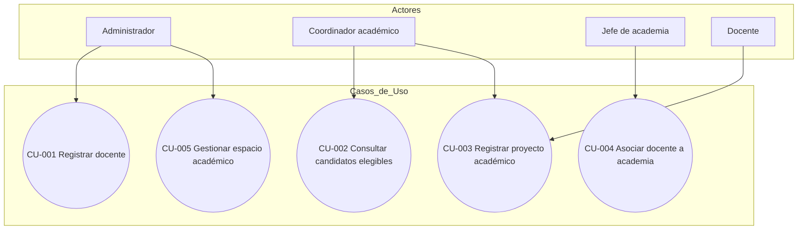
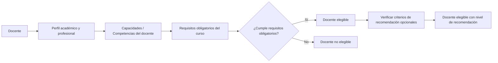
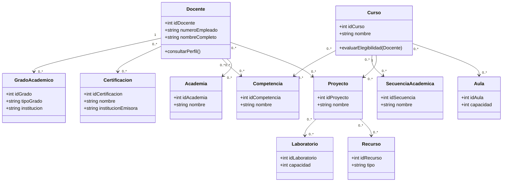

# Especificación de Requerimientos de Software
## Sistema de Gestión de Información Académica y Profesional de Docentes
### Proyecto: Desarrollo Rápido de Aplicaciones (RAD)

---

## 1. Resumen del Sistema

El sistema propuesto es una aplicación de gestión de información de docentes, cuyo propósito es centralizar los datos académicos, profesionales y administrativos del personal docente para apoyar procesos de asignación de cursos, secuencias académicas, proyectos, academias, aulas y laboratorios.

El sistema no realiza asignaciones automáticas por sí solo salvo que se defina explícitamente (ver sección 12, pregunta pendiente); su función principal, es proveer información estructurada que permita a coordinadores y jefes de academia tomar decisiones informadas sobre la elegibilidad de un docente para impartir un curso, participar en un proyecto o integrarse a una academia.

El alcance conceptual cubre siete dominios funcionales: docentes, cursos, secuencias académicas, proyectos, academias, espacios físicos (aulas/laboratorios) y recursos/equipamiento.

---

## 2. Alcance

### Incluido
- Registro y consulta de información de docentes (datos académicos, profesionales y certificaciones).
- Determinación de qué cursos puede impartir un docente según su perfil.
- Diseño de secuencias académicas.
- Registro de proyectos académicos (ejemplo: proyecto asociado al curso de Estructuras de Datos).
- Gestión de pertenencia de docentes a academias.
- Control de aulas y laboratorios.
- Generación de diagramas Mermaid del modelo conceptual.

### Explícitamente fuera de alcance por ahora
- Gestión de estudiantes como entidad plena (solo se menciona como posible ampliación).
- Sistema de reservación de horarios de aulas/laboratorios (**Requerimiento por definir**).
- Evaluación docente, nómina o gestión de RRHH.
- Notificaciones automáticas, reportes estadísticos avanzados o integración con sistemas externos (SIIA, plataformas institucionales, etc.).

### Requerimiento por definir
- Si el sistema debe cubrir múltiples periodos escolares/ciclos o solo el estado actual del docente.

---

## 3. Actores

| Actor | Estado | Objetivo principal |
|---|---|---|
| Administrador | Propuesto | Gestionar el sistema, usuarios y catálogos base |
| Coordinador académico | Propuesto | Consultar perfiles, tomar decisiones de asignación de cursos/proyectos |
| Jefe de academia | Propuesto | Gestionar integrantes de su academia, consultar candidatos |
| Docente | Propuesto | Consultar y posiblemente actualizar su propio perfil |

Las notas originales no mencionan actores explícitamente; **todos se presentan como actores propuestos**, derivados lógicamente de las funcionalidades descritas, no como requisito confirmado por el cliente.

### 3.1 Administrador (Propuesto)
- **Consulta:** toda la información del sistema.
- **Crea:** docentes, cursos, academias, aulas, laboratorios, catálogos (especialidades, certificaciones).
- **Modifica:** cualquier entidad.
- **Elimina:** con restricciones (Requerimiento por definir: ¿eliminación lógica o física?).
- **Restricciones:** ninguna funcional; sí debe existir control de acceso (ver RNF de seguridad).

### 3.2 Coordinador académico (Propuesto)
- **Consulta:** perfiles docentes, cursos, candidatos elegibles, secuencias.
- **Crea:** cursos, secuencias académicas, proyectos (Por definir si comparte este permiso con Administrador).
- **Modifica:** asociaciones curso-docente, secuencias, proyectos.
- **Elimina:** Por definir.
- **Restricciones:** no debería modificar datos personales sensibles del docente (SNI, PRODEP) — **Por definir**.

### 3.3 Jefe de academia (Propuesto)
- **Consulta:** docentes de su academia, candidatos a integrarla.
- **Crea:** Por definir (¿puede proponer ingreso de un docente o solo el Administrador lo autoriza?).
- **Modifica:** información de su academia.
- **Elimina:** Por definir.
- **Restricciones:** acceso limitado a su propia academia (**Por definir** si aplica).

### 3.4 Docente (Propuesto)
- **Consulta:** su propio perfil, cursos que puede impartir, proyectos en los que participa.
- **Crea:** Por definir (¿puede autorregistrar certificaciones para validación posterior?).
- **Modifica:** Por definir (¿puede editar datos propios o solo verlos?).
- **Elimina:** No se recomienda que el docente elimine su propia información.
- **Restricciones:** no debería modificar su propia elegibilidad para cursos (conflicto de interés).

---

## 4. Requerimientos Funcionales

### Gestión de docentes

**RF-001 — Registrar docente**
- Descripción: El sistema deberá permitir a un usuario autorizado registrar un docente capturando número de empleado, nombre completo, especialidad, grados académicos, SNI, perfil PRODEP y certificaciones.
- Actor responsable: Administrador (Propuesto: también Coordinador).
- Prioridad: Alta.
- Datos involucrados: entidad Docente y entidades relacionadas (Grado académico, Certificación).
- Precondiciones: el usuario cuenta con permisos de registro.
- Resultado esperado: el docente queda disponible para su asociación con cursos, proyectos y academias.

**RF-002 — Consultar docente**
- Descripción: El sistema deberá permitir consultar la información completa de un docente, incluyendo su perfil académico y profesional.
- Actor: Todos los actores (con restricciones de visibilidad por definir).
- Prioridad: Alta.

**RF-003 — Actualizar información de docente**
- Descripción: El sistema deberá permitir modificar los datos de un docente previamente registrado.
- Actor: Administrador (Propuesto: Docente para datos limitados).
- Prioridad: Alta.

**RF-004 — Buscar y filtrar docentes**
- Descripción: El sistema deberá permitir buscar docentes por criterios como especialidad, grado académico, certificación o academia.
- Actor: Coordinador académico, Jefe de academia, Administrador.
- Prioridad: Alta.

**RF-005 — Consultar grados académicos de un docente**
- Descripción: El sistema deberá permitir consultar licenciatura, maestría y doctorado asociados a un docente.
- Prioridad: Media.

**RF-006 — Consultar certificaciones de un docente**
- Descripción: El sistema deberá permitir consultar las certificaciones vigentes de un docente.
- Prioridad: Media.
- Nota: depende de si se maneja vigencia (ver sección 13).

**RF-007 — Consultar SNI y PRODEP**
- Descripción: El sistema deberá permitir consultar el estatus de SNI y perfil PRODEP de un docente.
- Prioridad: Media.
- Nota: el contenido exacto de estos campos es **Requerimiento por definir**.

**RF-008 — Asociar competencias/capacidades con un docente**
- Descripción: El sistema deberá permitir asociar una o más competencias a un docente, ya sea de forma manual (registrada por un administrador) o derivada de su formación.
- Actor: Administrador, Coordinador (Propuesto).
- Prioridad: Alta.
- Nota: el mecanismo de derivación automática es **Requerimiento por definir**.

### Gestión de cursos

**RF-009 — Registrar curso**
- Descripción: El sistema deberá permitir registrar un curso o asignatura con su nombre, identificador y requisitos asociados.
- Actor: Coordinador académico, Administrador.
- Prioridad: Alta.

**RF-010 — Definir requisitos de un curso**
- Descripción: El sistema deberá permitir definir las competencias, formación o certificaciones necesarias para impartir un curso, diferenciando entre requisitos obligatorios y criterios de recomendación.
- Prioridad: Alta.

**RF-011 — Asociar docentes capacitados con un curso**
- Descripción: El sistema deberá permitir asociar uno o más docentes como capacitados para impartir un curso específico.
- Prioridad: Alta.

**RF-012 — Consultar candidatos elegibles para un curso**
- Descripción: El sistema deberá permitir consultar la lista de docentes que cumplen los requisitos obligatorios de un curso determinado.
- Prioridad: Alta.

**RF-013 — Determinar elegibilidad de un docente para un curso**
- Descripción: El sistema deberá permitir verificar si un docente específico cumple con los requisitos obligatorios definidos para un curso.
- Prioridad: Alta.
- Nota: el algoritmo exacto de evaluación (automático vs. manual) es **Requerimiento por definir** (ver sección 13).

### Gestión de secuencias académicas

**RF-014 — Registrar secuencia académica**
- Descripción: El sistema deberá permitir crear una secuencia académica compuesta por un conjunto ordenado de cursos.
- Prioridad: Media.

**RF-015 — Definir prerrequisitos entre cursos**
- Descripción: El sistema deberá permitir establecer relaciones de precedencia entre cursos dentro de una secuencia.
- Prioridad: Media.

**RF-016 — Consultar secuencia académica**
- Descripción: El sistema deberá permitir consultar los cursos que componen una secuencia y su orden.
- Prioridad: Media.

### Gestión de proyectos académicos

**RF-017 — Registrar proyecto académico**
- Descripción: El sistema deberá permitir registrar un proyecto asociándolo opcionalmente a un curso, un docente responsable, docentes participantes y recursos requeridos.
- Prioridad: Media.
- Nota: si el proyecto es siempre dependiente de un curso es **Requerimiento por definir**.

**RF-018 — Asignar docente responsable a un proyecto**
- Descripción: El sistema deberá permitir designar un docente responsable para un proyecto registrado.
- Prioridad: Media.

**RF-019 — Asociar recursos y espacio físico a un proyecto**
- Descripción: El sistema deberá permitir asociar un aula o laboratorio, así como recursos/equipamiento, a un proyecto.
- Prioridad: Media.

### Gestión de academias

**RF-020 — Registrar academia**
- Descripción: El sistema deberá permitir registrar una academia con su nombre e identificador.
- Prioridad: Media.

**RF-021 — Asociar docente con academia**
- Descripción: El sistema deberá permitir asociar uno o más docentes a una academia.
- Prioridad: Media.

**RF-022 — Consultar academias de un docente**
- Descripción: El sistema deberá permitir consultar a qué academia(s) pertenece o puede pertenecer un docente.
- Prioridad: Media.

**RF-023 — Asociar cursos con academias**
- Descripción: El sistema deberá permitir asociar cursos a una academia cuando corresponda.
- Prioridad: Baja.

### Gestión de aulas y laboratorios

**RF-024 — Registrar aula o laboratorio**
- Descripción: El sistema deberá permitir registrar un espacio académico indicando tipo, capacidad y equipamiento disponible.
- Prioridad: Media.

**RF-025 — Consultar disponibilidad de espacios**
- Descripción: El sistema deberá permitir consultar qué aulas o laboratorios están disponibles para un curso o proyecto.
- Prioridad: Media.
- Nota: si "disponibilidad" implica horarios es **Requerimiento por definir**.

**RF-026 — Asociar cursos/proyectos con espacios físicos**
- Descripción: El sistema deberá permitir vincular un curso o proyecto con el aula o laboratorio requerido.
- Prioridad: Media.

---

## 5. Requerimientos No Funcionales

### 5.1 Derivados directamente del contexto
- **RNF-001 (Integridad de datos):** El sistema deberá garantizar que un docente no pueda ser marcado como elegible para un curso sin cumplir los requisitos obligatorios definidos.
- **RNF-002 (Autorización):** El sistema deberá restringir las operaciones de creación/modificación/eliminación según el rol del usuario autenticado.

### 5.2 Recomendados (Recomendación del analista, no solicitados explícitamente)
- **RNF-003 (Autenticación):** Se recomienda un mecanismo de autenticación de usuarios antes de permitir el acceso al sistema.
- **RNF-004 (Auditoría):** Se recomienda registrar quién y cuándo modifica información sensible (SNI, PRODEP, certificaciones).
- **RNF-005 (Usabilidad):** Se recomienda una interfaz simple, dado el contexto de un proyecto académico RAD con tiempo de desarrollo limitado.
- **RNF-006 (Mantenibilidad):** Se recomienda una arquitectura modular que separe las siete áreas funcionales identificadas.
- **RNF-007 (Respaldos):** Se recomienda respaldo periódico de la base de datos. Frecuencia: **pendiente de definición**.

### 5.3 Requieren confirmación
- **RNF-008 (Rendimiento):** No se establecen métricas de tiempo de respuesta por falta de información sobre volumen esperado de usuarios/datos. **Pendiente de definición**.
- **RNF-009 (Disponibilidad):** No se define un SLA de disponibilidad. **Pendiente de definición**.
- **RNF-010 (Escalabilidad):** El volumen esperado de docentes, cursos y proyectos no está especificado. **Pendiente de definición**.
- **RNF-011 (Privacidad):** El tratamiento de datos personales (SNI, PRODEP) podría estar sujeto a normativa de protección de datos institucional. **Pendiente de definición** si aplica un marco legal específico (p. ej. LFPDPPP en México).

---

## 6. Reglas de Negocio

| ID | Regla | Tipo |
|---|---|---|
| RN-001 | Un docente solo podrá ser considerado elegible para impartir un curso cuando cumpla con los requisitos obligatorios definidos para dicho curso. | Regla de negocio (requiere precisión: ver sección 13 sobre qué constituye "cumplir") |
| RN-002 | Un curso debe tener al menos un requisito definido antes de poder evaluar candidatos docentes. | Regla de negocio derivada, no confirmada — **por definir** |
| RN-003 | Un docente puede tener cero o más certificaciones asociadas. | Regla de negocio (estructural) |
| RN-004 | Un docente puede pertenecer a una o más academias. | **Por definir** — las notas no aclaran si la relación es exclusiva |
| RN-005 | Un proyecto académico requiere al menos un docente responsable. | Propuesta del analista — **por confirmar** |
| RN-006 | Las certificaciones podrían tener fecha de vencimiento, afectando la elegibilidad del docente. | **Por definir** (ver sección 13) |

**Aclaración:** RN-001 se presenta en las notas originales de forma conceptual. No se convierte aquí en regla definitiva porque el término "cumplir con los requisitos" requiere precisión (¿todos los requisitos obligatorios? ¿un porcentaje? ¿validación manual del coordinador?).

---

## 7. Entidades Preliminares (Modelo Conceptual)

> Nota: este es un modelo conceptual preliminar, no un diseño de base de datos definitivo.

### 7.1 Análisis de los atributos iniciales del docente

| Atributo original | Clasificación propuesta | Justificación |
|---|---|---|
| Número de empleado | Atributo simple (clave natural de Docente) | Identificador único |
| Nombre completo | Atributo simple | No requiere descomposición adicional salvo estandarización (nombre/apellidos) — **por definir** |
| Especialidad | Catálogo | Es probable que varios docentes compartan la misma especialidad; se recomienda tabla `Especialidad` |
| Licenciatura | Entidad independiente (Grado académico) | Requiere institución, año, área — no es un solo valor |
| Maestría | Entidad independiente (Grado académico) | Igual razonamiento que licenciatura |
| Doctorado | Entidad independiente (Grado académico) | Igual razonamiento |
| SNI | Entidad independiente o atributo compuesto | Podría requerir nivel, vigencia — **información insuficiente, por definir** |
| Perfil PRODEP | Atributo compuesto o entidad independiente | Podría requerir vigencia — **por definir** |
| Certificaciones | Entidad independiente (relación N:M con Docente) | Un docente puede tener varias; una certificación puede repetirse entre docentes |

**Recomendación:** en lugar de una tabla única "Docente" con todos los campos, se propone un modelo con una entidad central `Docente` y entidades relacionadas `GradoAcademico`, `Certificacion`, `Especialidad`, evitando redundancia y permitiendo múltiples grados o certificaciones por docente.

### 7.2 Entidades identificadas

| Entidad | Propósito | Atributos principales (preliminares) | Clave primaria propuesta | Relaciones importantes |
|---|---|---|---|---|
| Docente | Representa al profesor | id_docente, numero_empleado, nombre_completo, especialidad_id | id_docente | GradoAcademico, Certificacion, Curso, Academia, Proyecto |
| GradoAcademico | Registra licenciatura/maestría/doctorado del docente | id_grado, tipo_grado, institucion, area, docente_id | id_grado | Docente (N:1) |
| Certificacion | Catálogo/registro de certificaciones | id_certificacion, nombre, institucion_emisora, vigencia (**por definir**) | id_certificacion | Docente (N:M) |
| Especialidad | Catálogo de especialidades | id_especialidad, nombre | id_especialidad | Docente (1:N) |
| Competencia/Capacidad | Habilidades asociadas al perfil docente | id_competencia, nombre, descripcion | id_competencia | Docente (N:M), Curso (N:M) |
| Curso | Asignatura o materia | id_curso, nombre, clave | id_curso | Competencia, Secuencia, Proyecto, Academia, Aula |
| SecuenciaAcademica | Agrupación ordenada de cursos | id_secuencia, nombre | id_secuencia | Curso (N:M mediante relación con orden) |
| Proyecto | Proyecto académico | id_proyecto, nombre, descripcion, curso_id (opcional) | id_proyecto | Curso, Docente, Aula/Laboratorio, Recurso |
| Academia | Agrupación de docentes por área | id_academia, nombre | id_academia | Docente (N:M), Curso (N:M, opcional) |
| Aula | Espacio físico para docencia | id_aula, nombre, capacidad, tipo, equipamiento | id_aula | Curso, Proyecto |
| Laboratorio | Espacio físico especializado | id_laboratorio, nombre, capacidad, equipamiento | id_laboratorio | Curso, Proyecto |
| Recurso/Equipamiento | Recursos asociados a espacios o proyectos | id_recurso, nombre, tipo | id_recurso | Aula, Laboratorio, Proyecto |

**Nota:** Se recomienda modelar `Aula` y `Laboratorio` como una entidad genérica `EspacioAcademico` con un atributo `tipo` (aula/laboratorio) para reducir duplicación, aunque las notas los mencionan por separado — **decisión de diseño pendiente de confirmación**.

---

## 8. Relaciones y Cardinalidades

| Relación | Cardinalidad | Justificación |
|---|---|---|
| Docente — GradoAcademico | 1:N | Un docente puede tener varios grados (licenciatura, maestría, doctorado); cada grado pertenece a un solo docente |
| Docente — Certificación | N:M | Un docente puede tener varias certificaciones y una certificación (tipo) puede ser obtenida por varios docentes |
| Docente — Competencia | N:M | Un docente puede tener varias competencias; una competencia puede aplicar a varios docentes |
| Docente — Academia | N:M (propuesta) | Las notas no confirman exclusividad; se asume N:M salvo que se defina lo contrario — **por confirmar (ver RN-004)** |
| Curso — Competencia | N:M | Un curso puede requerir varias competencias; una competencia puede ser requisito de varios cursos |
| Curso — Secuencia | N:M | Un curso puede pertenecer a más de una secuencia (p. ej. como electivo en distintas trayectorias); una secuencia agrupa varios cursos |
| Curso — Proyecto | 1:N (propuesta) | Un curso puede tener varios proyectos asociados; un proyecto normalmente deriva de un solo curso — **por confirmar si un proyecto puede ser multi-curso** |
| Curso — Academia | N:M | Un curso puede pertenecer a más de una academia y una academia agrupa varios cursos |
| Proyecto — Docente | N:M | Un proyecto puede tener varios docentes participantes; un docente puede participar en varios proyectos |
| Curso — Aula/Laboratorio | N:M | Un curso puede impartirse en distintos espacios según el grupo/horario; un espacio puede usarse para varios cursos |
| Proyecto — Laboratorio | N:1 o N:M | Depende de si un proyecto usa un solo espacio o varios — **por definir** |

---

## 9. Casos de Uso

**CU-001 — Registrar docente**
- Actor principal: Administrador.
- Objetivo: Incorporar un nuevo docente al sistema con su información básica.
- Precondiciones: Usuario autenticado con permisos de registro.
- Flujo principal: 1) El actor accede al módulo de docentes. 2) Captura datos obligatorios. 3) El sistema valida la información. 4) El sistema almacena el registro.
- Flujos alternativos: El actor agrega grados académicos y certificaciones en el mismo flujo o posteriormente.
- Excepciones: Número de empleado duplicado → el sistema rechaza el registro.
- Resultado esperado: Docente disponible para asociaciones futuras.

**CU-002 — Consultar candidatos elegibles para un curso**
- Actor principal: Coordinador académico.
- Objetivo: Obtener la lista de docentes que cumplen los requisitos de un curso.
- Precondiciones: El curso tiene requisitos definidos (RF-010).
- Flujo principal: 1) El actor selecciona un curso. 2) El sistema evalúa a los docentes registrados contra los requisitos obligatorios. 3) El sistema despliega la lista de candidatos.
- Flujos alternativos: El actor filtra adicionalmente por academia o especialidad.
- Excepciones: Ningún docente cumple los requisitos → el sistema informa que no hay candidatos.
- Resultado esperado: Lista de docentes elegibles (y opcionalmente recomendados).

**CU-003 — Registrar proyecto académico**
- Actor principal: Coordinador académico / Docente responsable.
- Objetivo: Crear un proyecto asociado a un curso, docentes y recursos.
- Precondiciones: Existe al menos un docente y, opcionalmente, un curso registrado.
- Flujo principal: 1) El actor crea el proyecto. 2) Asigna docente(s) responsable(s)/participante(s). 3) Asocia curso (si aplica). 4) Asocia espacio/recursos.
- Excepciones: Falta de docente responsable → el sistema no permite guardar (según RN-005, pendiente de confirmación).
- Resultado esperado: Proyecto registrado y disponible para consulta.

**CU-004 — Asociar docente a academia**
- Actor principal: Jefe de academia / Administrador.
- Objetivo: Incorporar un docente a una academia.
- Precondiciones: Docente y academia existen previamente.
- Flujo principal: 1) El actor selecciona docente y academia. 2) El sistema valida la asociación. 3) El sistema registra la pertenencia.
- Resultado esperado: El docente queda asociado a la academia.

**CU-005 — Gestionar espacio académico (aula/laboratorio)**
- Actor principal: Administrador.
- Objetivo: Registrar y mantener actualizados los espacios disponibles.
- Precondiciones: Usuario con permisos administrativos.
- Flujo principal: 1) El actor registra el espacio con capacidad y equipamiento. 2) El sistema lo hace disponible para asociación con cursos/proyectos.
- Resultado esperado: Espacio disponible para su uso en la planeación académica.

---

## 10. Matriz de Trazabilidad Preliminar

| Regla de negocio | Requerimiento funcional | Caso de uso | Entidades involucradas |
|---|---|---|---|
| RN-001 | RF-010, RF-012, RF-013 | CU-002 | Docente, Curso, Competencia |
| RN-002 | RF-010 | CU-002 | Curso, Competencia |
| RN-003 | RF-006 | CU-001 | Docente, Certificación |
| RN-004 | RF-021, RF-022 | CU-004 | Docente, Academia |
| RN-005 | RF-017, RF-018 | CU-003 | Proyecto, Docente |
| RN-006 | RF-006 | CU-001 | Docente, Certificación |

---

## 11. Diagramas Mermaid

### A. Diagrama de casos de uso (representación equivalente)

### B. Diagrama entidad-relación conceptual

### C. Diagrama de flujo general — Elegibilidad docente-curso

### D. Diagrama de clases conceptual

---

## 12. Preguntas Pendientes de Levantamiento

1. ¿Quién puede registrar docentes: solo el Administrador o también el Coordinador académico?
2. ¿Quién puede modificar información sensible como SNI y PRODEP?
3. ¿Qué significa exactamente que un docente esté "capacitado" para un curso: cumplimiento total de requisitos, cumplimiento parcial, o validación manual de un coordinador?
4. ¿La capacitación/elegibilidad se determina de forma automática (por reglas) o siempre requiere confirmación de un administrador/coordinador?
5. ¿Las certificaciones tienen fecha de expiración? ¿Afecta esto la elegibilidad del docente?
6. ¿Un docente puede pertenecer a varias academias simultáneamente, o solo a una?
7. ¿Un curso puede pertenecer a varias academias?
8. ¿Cómo se determina formalmente la compatibilidad entre un docente y un curso (criterios ponderados, checklist, decisión humana)?
9. ¿Qué diferencia conceptual existe entre "capacidad/competencia", "especialidad" y "certificación" dentro del sistema?
10. ¿Qué información específica se debe almacenar sobre el SNI (nivel, vigencia, área)?
11. ¿Qué información específica se debe almacenar sobre el perfil PRODEP (vigencia, tipo de reconocimiento)?
12. ¿Las aulas y laboratorios manejarán horarios y reservaciones, o solo disponibilidad general?
13. ¿El sistema realizará asignación automática de docentes a cursos/proyectos, o únicamente proporcionará información de apoyo para que un coordinador decida?
14. ¿Los proyectos académicos son siempre dependientes de un curso o pueden existir de forma independiente?
15. ¿Se manejarán periodos escolares, semestres o ciclos académicos como dimensión temporal del sistema?
16. ¿Se requiere gestión de estudiantes en alguna etapa futura del proyecto?
17. ¿Existen políticas institucionales de privacidad de datos que el sistema deba cumplir?

---

## 13. Priorización MoSCoW

### Must Have (esenciales para el MVP)
- RF-001, RF-002, RF-003, RF-004 (gestión básica de docentes).
- RF-009, RF-010, RF-011, RF-012, RF-013 (gestión de cursos y elegibilidad — núcleo del sistema según las notas).
- RF-020, RF-021, RF-022 (gestión básica de academias).

*Justificación:* estas funciones representan el objetivo central expresado en las notas: vincular perfil docente con capacidad de impartir cursos.

### Should Have
- RF-005, RF-006, RF-007, RF-008 (detalle del perfil docente).
- RF-024, RF-025, RF-026 (aulas y laboratorios básicos).

*Justificación:* enriquecen el perfil y contexto físico, pero el sistema puede operar sin ellos en una primera iteración.

### Could Have
- RF-014, RF-015, RF-016 (secuencias académicas).
- RF-017, RF-018, RF-019 (proyectos académicos).
- RF-023 (curso-academia).

*Justificación:* son funcionalidades explícitamente mencionadas en las notas, pero de mayor complejidad relativa y menor urgencia frente al núcleo docente-curso.

### Won't Have (por ahora)
- Gestión de estudiantes.
- Reservación de horarios de espacios.
- Reportes analíticos avanzados.
- Notificaciones automáticas.

*Justificación:* no están contempladas en las notas originales; se documentan únicamente como posibles ampliaciones futuras.

---

## 14. Alcance del MVP

### MVP propuesto
- Registro, consulta, actualización y búsqueda de docentes con sus grados académicos y certificaciones.
- Registro de cursos con requisitos obligatorios.
- Determinación de elegibilidad docente-curso (evaluación básica, sin ponderaciones complejas).
- Registro de academias y asociación con docentes.
- Diagramas Mermaid del modelo conceptual (ya cubiertos en este documento).

### Segunda etapa
- Gestión de secuencias académicas.
- Gestión de proyectos académicos.
- Gestión de aulas y laboratorios con asociación a cursos/proyectos.
- Asociación curso-academia.

### Funcionalidades futuras
- Reservación de horarios para espacios físicos.
- Gestión de estudiantes.
- Asignación automática (algorítmica) de docentes a cursos.
- Auditoría avanzada y reportes analíticos.

---

## 15. Riesgos y Observaciones

- **Riesgo de ambigüedad en "elegibilidad":** sin una definición precisa de qué constituye cumplimiento de requisitos, el módulo central del sistema (RF-013) corre riesgo de implementarse con lógica arbitraria.
- **Riesgo de alcance (scope creep):** las notas mencionan siete dominios funcionales; para un proyecto académico de RAD con tiempo limitado, cubrir los siete a nivel completo puede ser inviable. Se recomienda priorizar el MVP definido en la sección 14.
- **Riesgo de sobrediseño de entidades:** SNI y PRODEP podrían implementarse como simples atributos booleanos/texto en una primera versión, en lugar de entidades complejas, hasta que se aclare su estructura real.
- **Riesgo de falta de actores confirmados:** al no existir actores explícitos en las notas, el modelo de permisos es especulativo y debe validarse con el cliente/profesor de la materia antes de implementar control de acceso.
- **Observación:** el ejemplo del curso "Estructuras de Datos" es ilustrativo; no debe interpretarse como un requisito de que el sistema contenga un catálogo fijo de cursos de informática.

---

## 16. Revisión Crítica

### Requerimientos ambiguos
- RF-013 (determinar elegibilidad): el criterio de evaluación no está definido con precisión suficiente para ser verificable sin ambigüedad.
- RF-025 (disponibilidad de espacios): el término "disponibilidad" puede interpretarse como estado general o como sistema de horarios; ambas interpretaciones son válidas y deben aclararse.

### Requerimientos potencialmente duplicados
- RF-006 (consultar certificaciones) y RF-002 (consultar docente) podrían solaparse si el perfil completo del docente ya incluye certificaciones; se recomienda mantener RF-006 solo si se requiere una vista filtrada independiente.

### Requerimientos contradictorios
- No se detectaron contradicciones directas entre los requerimientos funcionales listados; sin embargo, existe tensión potencial entre RN-001 (elegibilidad basada en cumplimiento estricto) y la posible necesidad de decisión humana discrecional mencionada como pregunta pendiente (punto 13 de la sección 12). Debe resolverse antes del diseño detallado.

### Información faltante crítica
- Estructura de datos de SNI y PRODEP.
- Definición de vigencia de certificaciones.
- Definición de si la relación docente-academia es exclusiva o múltiple.
- Confirmación de actores reales y sus permisos.

### Funcionalidades que podrían ser demasiado complejas para el alcance académico
- Evaluación automática ponderada de elegibilidad (RF-013) con múltiples criterios puede exceder el tiempo disponible en un proyecto RAD; se recomienda iniciar con una evaluación binaria simple (cumple/no cumple requisitos obligatorios).
- Sistema de reservación de horarios de aulas/laboratorios, si se llegara a solicitar, es una funcionalidad de complejidad considerable y se recomienda dejarla fuera del MVP.

### Entidades posiblemente sobredimensionadas
- SNI y PRODEP como entidades independientes podrían ser innecesarias si su contenido real es simple (por ejemplo, un valor booleano y una fecha). Se recomienda confirmarlo antes del modelado final.
- Aula y Laboratorio podrían unificarse en una sola entidad `EspacioAcademico` con un atributo de tipo, reduciendo duplicación de estructura.

### Riesgos del proyecto
Ver sección 15.

### Decisiones de diseño que deberían posponerse
- Modelo definitivo de base de datos para SNI/PRODEP.
- Mecanismo de evaluación de elegibilidad (regla simple vs. motor de reglas configurable).
- Unificación o separación de Aula/Laboratorio.
- Cardinalidad definitiva Docente-Academia.

---

**Nota final:** Este documento constituye una base de análisis preliminar derivada de notas informales. Los elementos marcados como "Propuesta", "Recomendación" o "Por definir" **no deben considerarse requisitos confirmados por el cliente** hasta su validación explícita.
