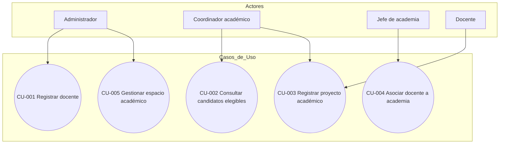
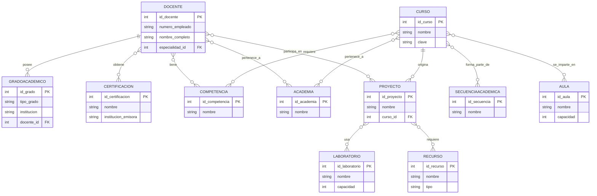
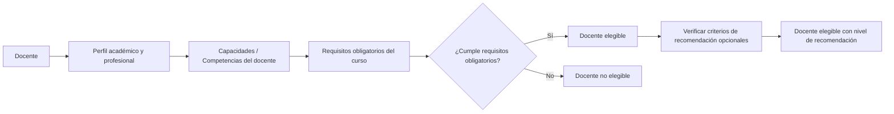

# Levantamiento de Requerimientos de Software
## Sistema de Gestión de Información Académica y Profesional de Docentes
### Proyecto: Desarrollo Rápido de Aplicaciones (RAD)

---
# 1. Resumen del Sistema

El sistema propuesto es una aplicación de gestión de información de docentes, cuyo propósito es centralizar los datos académicos, profesionales y administrativos del personal docente para apoyar procesos de asignación de cursos, secuencias académicas, proyectos, academias, aulas y laboratorios.

El sistema no realizará asignaciones automáticas de docentes. Su función principal será proporcionar información estructurada y realizar una evaluación automática de elegibilidad que permita al administrador identificar qué docentes cumplen con los criterios establecidos para impartir un determinado curso. La decisión final de asignación será realizada manualmente por el administrador.

El sistema permitirá considerar información como grados académicos, especialidad, competencias, certificaciones, SNI/SNII, perfil PRODEP, pertenencia a academias y nivel de dominio de los cursos.

El alcance conceptual cubre siete dominios funcionales:

1. Docentes.
2. Cursos.
3. Secuencias académicas.
4. Proyectos.
5. Academias.
6. Espacios físicos (aulas y laboratorios).
7. Recursos y equipamiento.

La primera versión del sistema contará únicamente con un usuario operativo de tipo **Administrador** y no implementará autenticación.

---

# 2. Alcance

## Incluido

### Gestión de docentes

- Registro y consulta de información de docentes.
- Actualización de información de docentes.
- Búsqueda y filtrado de docentes.
- Registro de grados académicos.
- Registro de certificaciones.
- Registro de competencias y capacidades.
- Registro de especialidad.
- Registro de información de SNI/SNII.
- Registro de información de perfil PRODEP.
- Registro del nivel de dominio de un docente sobre cursos.

### Gestión de cursos

- Registro y consulta de cursos.
- Definición de requisitos de cursos.
- Clasificación de requisitos como obligatorios o recomendados.
- Definición del nivel mínimo de dominio requerido.
- Determinación automática de docentes elegibles.
- Consulta de candidatos para impartir un curso.
- Registro manual de asignaciones docente-curso.

### Gestión de academias

- Registro de academias.
- Asociación de docentes con academias.
- Asociación de cursos con academias.
- Consulta de integrantes y cursos asociados.

### Gestión de secuencias académicas

- Registro de secuencias.
- Asociación de cursos.
- Definición del orden de los cursos.
- Definición de relaciones de precedencia entre cursos.

### Gestión de proyectos académicos

- Registro de proyectos.
- Asociación obligatoria de un proyecto con un curso.
- Asociación de docentes participantes.
- Designación de un docente responsable.
- Asociación de espacios físicos.
- Asociación de recursos y equipamiento.

### Gestión de espacios físicos

- Registro de aulas y laboratorios.
- Registro de capacidad.
- Registro de estado.
- Registro de equipamiento y recursos disponibles.
- Asociación de cursos y proyectos con espacios.

### Gestión de recursos

- Registro de recursos y equipamiento.
- Control de cantidad.
- Asociación de recursos con espacios.
- Asociación de recursos con proyectos.

### Diseño

- Generación de diagramas Mermaid del modelo conceptual.
- Diseño de la interfaz y navegación mediante Excalidraw.

---

## Explícitamente fuera de alcance por ahora

- Gestión de estudiantes como entidad plena.
- Sistema de autenticación e inicio de sesión.
- Administración de múltiples tipos de usuario.
- Sistema de permisos basado en roles.
- Sistema de reservación de horarios de aulas/laboratorios.
- Gestión de horarios y bloques temporales.
- Evaluación docente.
- Nómina o gestión de recursos humanos.
- Notificaciones automáticas.
- Reportes estadísticos avanzados.
- Integración con sistemas externos.
- Asignación automática de docentes.
- Gestión histórica de múltiples periodos escolares.

La primera versión representará únicamente el **estado académico actual**.

---

# 3. Usuario del Sistema

La primera versión del sistema contará con un único usuario operativo:

| Usuario | Estado | Objetivo principal |
|---|---|---|
| Administrador | Confirmado para la primera versión | Gestionar docentes, cursos, academias, secuencias, proyectos, espacios, recursos y asignaciones |

No se implementarán actualmente los roles de Coordinador académico, Jefe de academia o Docente como usuarios independientes del sistema.

El término "Administrador" representa al usuario que opera la aplicación y concentra las funciones necesarias para el prototipo.

## 3.1 Administrador

**Consulta:** toda la información disponible en el sistema.

**Crea:**

- Docentes.
- Grados académicos.
- Certificaciones.
- Competencias.
- Cursos.
- Requisitos.
- Academias.
- Secuencias.
- Proyectos.
- Aulas.
- Laboratorios.
- Recursos.

**Modifica:** cualquier entidad disponible.

**Elimina:** se priorizará la desactivación de registros cuando existan relaciones dependientes, en lugar de eliminar físicamente información que pueda afectar la integridad del sistema.

**Restricciones:** no existen restricciones funcionales dentro del sistema para esta primera versión.

### Autenticación

No se implementará autenticación en la primera versión.

El sistema asumirá que el usuario que accede a la aplicación es el administrador autorizado.

La implementación de usuarios, contraseñas, sesiones y permisos queda fuera del alcance actual.

---

# 4. Requerimientos Funcionales

## Gestión de docentes

### RF-001 — Registrar docente

**Descripción:** El sistema deberá permitir al administrador registrar un docente capturando número de empleado, nombre completo, especialidad, grados académicos, información de SNI/SNII, perfil PRODEP y certificaciones.

**Actor responsable:** Administrador.

**Prioridad:** Alta.

**Datos involucrados:** entidad Docente y entidades relacionadas.

**Precondiciones:** ninguna relacionada con autenticación.

**Resultado esperado:** el docente queda registrado y disponible para su asociación con cursos, proyectos y academias.

---

### RF-002 — Consultar docente

**Descripción:** El sistema deberá permitir consultar la información completa de un docente, incluyendo su perfil académico y profesional.

**Actor:** Administrador.

**Prioridad:** Alta.

---

### RF-003 — Actualizar información de docente

**Descripción:** El sistema deberá permitir modificar los datos de un docente previamente registrado.

**Actor:** Administrador.

**Prioridad:** Alta.

---

### RF-004 — Buscar y filtrar docentes

**Descripción:** El sistema deberá permitir buscar y filtrar docentes utilizando criterios como:

- Número de empleado.
- Nombre.
- Especialidad.
- Grado académico.
- Certificación.
- Competencia.
- Academia.
- Curso.

**Actor:** Administrador.

**Prioridad:** Alta.

---

### RF-005 — Consultar grados académicos de un docente

**Descripción:** El sistema deberá permitir consultar los grados académicos asociados a un docente, incluyendo licenciatura, maestría y doctorado.

**Prioridad:** Media.

---

### RF-006 — Consultar certificaciones de un docente

**Descripción:** El sistema deberá permitir consultar las certificaciones asociadas a un docente, incluyendo su vigencia cuando corresponda.

**Prioridad:** Media.

---

### RF-007 — Consultar SNI/SNII y PRODEP

**Descripción:** El sistema deberá permitir consultar el estatus de SNI/SNII y perfil PRODEP de un docente.

Para SNI/SNII se podrá almacenar:

- Estatus.
- Nivel.
- Área, cuando corresponda.
- Fecha de inicio de vigencia.
- Fecha de fin de vigencia.

Para PRODEP se podrá almacenar:

- Estatus.
- Tipo o modalidad.
- Fecha de inicio de vigencia.
- Fecha de fin de vigencia.

**Prioridad:** Media.

---

### RF-008 — Asociar competencias/capacidades con un docente

**Descripción:** El sistema deberá permitir asociar una o más competencias o capacidades a un docente.

Las competencias serán registradas de manera explícita y podrán utilizarse como requisitos para los cursos.

**Actor:** Administrador.

**Prioridad:** Alta.

---

### RF-009 — Registrar nivel de dominio de un docente sobre un curso

**Descripción:** El sistema deberá permitir registrar el nivel de dominio de un docente sobre un curso en una escala de 0 a 10.

El nivel será capturado manualmente por el administrador.

**Actor:** Administrador.

**Prioridad:** Alta.

---

## Gestión de cursos

### RF-010 — Registrar curso

**Descripción:** El sistema deberá permitir registrar un curso o asignatura con su nombre, clave, descripción y nivel mínimo de dominio requerido.

**Actor:** Administrador.

**Prioridad:** Alta.

---

### RF-011 — Definir requisitos de un curso

**Descripción:** El sistema deberá permitir definir las competencias necesarias para impartir un curso, diferenciando entre:

- Requisitos obligatorios.
- Requisitos recomendados.

También deberá permitir establecer el nivel mínimo de dominio requerido para el curso.

**Actor:** Administrador.

**Prioridad:** Alta.

---

### RF-012 — Consultar candidatos elegibles para un curso

**Descripción:** El sistema deberá permitir consultar la lista de docentes que cumplen los requisitos obligatorios de un curso determinado.

La lista podrá mostrar:

- Nivel de dominio.
- Especialidad.
- Grados académicos.
- Competencias.
- Certificaciones.
- Academia o academias a las que pertenece.
- SNI/SNII.
- PRODEP.

**Prioridad:** Alta.

---

### RF-013 — Determinar elegibilidad de un docente para un curso

**Descripción:** El sistema deberá determinar automáticamente si un docente cumple las condiciones necesarias para impartir un curso.

Un docente será considerado elegible cuando:

1. Cumpla todos los requisitos obligatorios.
2. Su nivel de dominio sea igual o superior al nivel mínimo requerido por el curso.
3. Las certificaciones obligatorias requeridas se encuentren vigentes.

**Prioridad:** Alta.

---

### RF-014 — Registrar asignación de docente a curso

**Descripción:** El sistema deberá permitir al administrador registrar manualmente la asignación de un docente a un curso después de consultar los candidatos elegibles.

El sistema deberá validar nuevamente que el docente cumpla los requisitos obligatorios antes de registrar la asignación.

**Prioridad:** Alta.

---

## Gestión de secuencias académicas

### RF-015 — Registrar secuencia académica

**Descripción:** El sistema deberá permitir crear una secuencia académica compuesta por un conjunto ordenado de cursos.

**Prioridad:** Media.

---

### RF-016 — Definir relaciones de precedencia entre cursos

**Descripción:** El sistema deberá permitir establecer el orden y las relaciones de precedencia entre cursos dentro de una secuencia académica.

**Prioridad:** Media.

---

### RF-017 — Consultar secuencia académica

**Descripción:** El sistema deberá permitir consultar los cursos que componen una secuencia y su orden correspondiente.

**Prioridad:** Media.

---

## Gestión de proyectos académicos

### RF-018 — Registrar proyecto académico

**Descripción:** El sistema deberá permitir registrar un proyecto académico asociado obligatoriamente a un curso.

El proyecto podrá contener:

- Nombre.
- Descripción.
- Estado.
- Curso asociado.
- Docente responsable.
- Docentes participantes.
- Espacios físicos.
- Recursos requeridos.

**Prioridad:** Media.

---

### RF-019 — Asignar docente responsable a un proyecto

**Descripción:** El sistema deberá permitir designar un docente responsable para un proyecto registrado.

Cada proyecto deberá tener exactamente un docente responsable.

**Prioridad:** Media.

---

### RF-020 — Asociar docentes participantes a un proyecto

**Descripción:** El sistema deberá permitir asociar uno o varios docentes participantes a un proyecto.

Un docente podrá participar en múltiples proyectos.

**Prioridad:** Media.

---

### RF-021 — Asociar recursos y espacio físico a un proyecto

**Descripción:** El sistema deberá permitir asociar uno o varios espacios académicos, así como recursos y equipamiento, a un proyecto.

**Prioridad:** Media.

---

## Gestión de academias

### RF-022 — Registrar academia

**Descripción:** El sistema deberá permitir registrar una academia con:

- Nombre.
- Clave.
- Descripción.
- Estado.

La clave de la academia será alfanumérica, tendrá una longitud máxima de 10 caracteres y deberá ser única.

**Prioridad:** Media.

---

### RF-023 — Asociar docente con academia

**Descripción:** El sistema deberá permitir asociar uno o más docentes a una academia.

Un docente podrá pertenecer a una o varias academias.

**Prioridad:** Media.

---

### RF-024 — Consultar academias de un docente

**Descripción:** El sistema deberá permitir consultar a qué academia o academias pertenece un docente.

**Prioridad:** Media.

---

### RF-025 — Asociar cursos con academias

**Descripción:** El sistema deberá permitir asociar cursos a una o varias academias cuando corresponda.

La coincidencia entre la academia del curso y la academia del docente podrá utilizarse como criterio de recomendación durante la consulta de candidatos.

**Prioridad:** Media.

---

## Gestión de aulas y laboratorios

### RF-026 — Registrar aula o laboratorio

**Descripción:** El sistema deberá permitir registrar un espacio académico indicando:

- Nombre.
- Tipo.
- Capacidad.
- Estado.
- Recursos/equipamiento disponible.

Los tipos de espacio serán:

- Aula.
- Laboratorio.

**Prioridad:** Media.

---

### RF-027 — Consultar disponibilidad general de espacios

**Descripción:** El sistema deberá permitir consultar qué espacios se encuentran disponibles o no disponibles para su asociación con cursos o proyectos.

En esta versión, la disponibilidad será general y no estará relacionada con horarios específicos.

**Prioridad:** Media.

---

### RF-028 — Asociar cursos/proyectos con espacios físicos

**Descripción:** El sistema deberá permitir vincular uno o varios cursos o proyectos con los espacios académicos requeridos.

Esta asociación no representa una reservación de horario.

**Prioridad:** Media.

---

## Gestión de recursos y equipamiento

### RF-029 — Registrar recurso o equipamiento

**Descripción:** El sistema deberá permitir registrar recursos o equipamiento indicando:

- Nombre.
- Tipo.
- Cantidad.
- Estado.

**Prioridad:** Media.

---

### RF-030 — Asociar recursos a espacios académicos

**Descripción:** El sistema deberá permitir asociar recursos a aulas o laboratorios, indicando la cantidad disponible.

**Prioridad:** Media.

---

### RF-031 — Asociar recursos a proyectos

**Descripción:** El sistema deberá permitir asociar recursos a proyectos, indicando la cantidad requerida.

**Prioridad:** Media.

---

# 5. Requerimientos No Funcionales

## 5.1 Derivados directamente del contexto

### RNF-001 — Integridad de datos

El sistema deberá garantizar que un docente no pueda ser considerado elegible para un curso sin cumplir los requisitos obligatorios definidos y el nivel mínimo de dominio establecido.

---

### RNF-002 — Consistencia de relaciones

El sistema deberá mantener la integridad de las relaciones entre docentes, cursos, academias, proyectos, espacios y recursos.

No deberán generarse asociaciones duplicadas ni referencias a entidades inexistentes.

---

### RNF-003 — Validación de datos

El sistema deberá validar los datos ingresados, incluyendo:

- Unicidad del número de empleado.
- Unicidad de la clave del curso.
- Unicidad de la clave de academia.
- Nivel de dominio entre 0 y 10.
- Capacidad de espacios mayor que cero.
- Fechas de certificación válidas.
- Claves de academia con máximo 10 caracteres alfanuméricos.

---

## 5.2 Recomendados

### RNF-004 — Usabilidad

Se recomienda una interfaz simple y consistente, dado el contexto de un proyecto académico RAD con tiempo de desarrollo limitado.

La navegación deberá organizarse mediante módulos claramente identificables.

---

### RNF-005 — Mantenibilidad

Se recomienda una arquitectura modular que separe las principales áreas funcionales:

- Docentes.
- Cursos.
- Academias.
- Secuencias.
- Proyectos.
- Espacios.
- Recursos.

---

### RNF-006 — Respaldos

Se recomienda realizar respaldos periódicos de la base de datos, especialmente antes de demostraciones o modificaciones importantes.

La frecuencia exacta no será una funcionalidad del sistema y dependerá del entorno de desarrollo.

---

### RNF-007 — Rendimiento

Para el prototipo se establece como objetivo que las consultas comunes respondan en aproximadamente 2 segundos o menos bajo un volumen esperado de hasta:

- 500 docentes.
- 200 cursos.
- 50 academias.
- 100 espacios académicos.

---

### RNF-008 — Disponibilidad

No se establecerá un SLA formal.

La aplicación estará orientada inicialmente a un entorno académico, de desarrollo y demostración.

---

### RNF-009 — Escalabilidad

La arquitectura deberá mantenerse modular para permitir una ampliación futura del sistema, aunque no se establece como requisito una infraestructura de escalabilidad empresarial para la primera versión.

---

### RNF-010 — Privacidad

El sistema almacenará únicamente información académica y profesional necesaria para sus funciones.

No se almacenarán contraseñas, información bancaria, médica u otra información personal sensible que no sea necesaria para el objetivo del sistema.

La implementación de políticas institucionales específicas de protección de datos queda fuera del alcance técnico del prototipo.

---

# 6. Reglas de Negocio

| ID | Regla | Tipo |
|---|---|---|
| RN-001 | Un docente solo podrá ser considerado elegible para impartir un curso cuando cumpla todos los requisitos obligatorios definidos para dicho curso. | Regla de negocio |
| RN-002 | El nivel de dominio de un docente sobre un curso deberá encontrarse entre 0 y 10. | Regla de negocio |
| RN-003 | Un docente será elegible cuando su nivel de dominio sea igual o superior al nivel mínimo requerido por el curso. | Regla de negocio |
| RN-004 | Las certificaciones que sean requisitos obligatorios deberán encontrarse vigentes para que puedan considerarse cumplidas. | Regla de negocio |
| RN-005 | Los requisitos recomendados no impedirán que un docente sea considerado elegible. | Regla de negocio |
| RN-006 | La coincidencia entre la academia del docente y la academia asociada al curso será un criterio de recomendación, no un requisito obligatorio. | Regla de negocio |
| RN-007 | Un docente puede pertenecer a una o varias academias. | Regla estructural |
| RN-008 | Un curso puede estar asociado a una o varias academias. | Regla estructural |
| RN-009 | La elegibilidad se determinará automáticamente mediante las reglas establecidas. | Regla funcional |
| RN-010 | La asignación final de un docente a un curso será realizada manualmente por el administrador. | Regla funcional |
| RN-011 | El sistema no permitirá registrar una asignación docente-curso si el docente no cumple los requisitos obligatorios. | Regla de integridad |
| RN-012 | Un docente puede tener cero o más certificaciones. | Regla estructural |
| RN-013 | Un docente puede tener cero o más grados académicos registrados. | Regla estructural |
| RN-014 | Un proyecto académico pertenece obligatoriamente a un único curso. | Regla estructural |
| RN-015 | Un proyecto deberá tener exactamente un docente responsable. | Regla de negocio |
| RN-016 | Un proyecto puede tener cero o varios docentes participantes adicionales. | Regla estructural |
| RN-017 | Un curso puede tener cero o varios proyectos asociados. | Regla estructural |
| RN-018 | Un curso puede pertenecer a varias secuencias académicas. | Regla estructural |
| RN-019 | Un curso no podrá aparecer más de una vez dentro de la misma secuencia académica. | Regla de integridad |
| RN-020 | La primera versión del sistema manejará únicamente el estado académico actual y no administrará múltiples periodos escolares. | Regla de alcance |
| RN-021 | La disponibilidad de aulas y laboratorios se manejará como estado general y no como disponibilidad por horario. | Regla de alcance |
| RN-022 | Las entidades principales podrán desactivarse en lugar de eliminarse físicamente cuando existan relaciones dependientes. | Regla de integridad |

---

### 7.2 Entidades identificadas

| Entidad | Propósito | Atributos principales (preliminares) | Clave primaria propuesta | Relaciones importantes |
|---|---|---|---|---|
| Docente | Representa al profesor | id_docente, numero_empleado, nombre_completo, especialidad_id | id_docente | GradoAcademico, Certificacion, Curso, Academia, Proyecto |
| GradoAcademico | Registra licenciatura/maestría/doctorado del docente | id_grado, tipo_grado, institucion, area, docente_id | id_grado | Docente (N:1) |
| Certificacion | Catálogo/registro de certificaciones | id_certificacion, nombre, institucion_emisora, vigencia (**por definir**) | id_certificacion | Docente (N:M) |
| Especialidad | Catálogo de especialidades | id_especialidad, nombre | id_especialidad | Docente (1:N) |
| Competencia/Capacidad | Habilidades asociadas al perfil docente | id_competencia, nombre, descripcion | id_competencia | Docente (N:M), Curso (N:M) |
| Curso | Asignatura o materia | id_curso, nombre, clave | id_curso | Competencia, Secuencia, Proyecto, Academia, Aula |
| SecuenciaAcademica | Agrupación ordenada de cursos | id_secuencia, nombre | id_secuencia | Curso (N:M mediante relación con orden) |
| Proyecto | Proyecto académico | id_proyecto, nombre, descripcion, curso_id (opcional) | id_proyecto | Curso, Docente, Aula/Laboratorio, Recurso |
| Academia | Agrupación de docentes por área | id_academia, nombre | id_academia | Docente (N:M), Curso (N:M, opcional) |
| Aula | Espacio físico para docencia | id_aula, nombre, capacidad, tipo, equipamiento | id_aula | Curso, Proyecto |
| Laboratorio | Espacio físico especializado | id_laboratorio, nombre, capacidad, equipamiento | id_laboratorio | Curso, Proyecto |
| Recurso/Equipamiento | Recursos asociados a espacios o proyectos | id_recurso, nombre, tipo | id_recurso | Aula, Laboratorio, Proyecto |

**Nota:** Se recomienda modelar `Aula` y `Laboratorio` como una entidad genérica `EspacioAcademico` con un atributo `tipo` (aula/laboratorio) para reducir duplicación, aunque las notas los mencionan por separado — **decisión de diseño pendiente de confirmación**.

---

## 8. Relaciones y Cardinalidades

| Relación | Cardinalidad | Justificación |
|---|---|---|
| Docente — GradoAcademico | 1:N | Un docente puede tener varios grados (licenciatura, maestría, doctorado); cada grado pertenece a un solo docente |
| Docente — Certificación | N:M | Un docente puede tener varias certificaciones y una certificación (tipo) puede ser obtenida por varios docentes |
| Docente — Competencia | N:M | Un docente puede tener varias competencias; una competencia puede aplicar a varios docentes |
| Docente — Academia | N:M (propuesta) | Las notas no confirman exclusividad; se asume N:M salvo que se defina lo contrario — **por confirmar (ver RN-004)** |
| Curso — Competencia | N:M | Un curso puede requerir varias competencias; una competencia puede ser requisito de varios cursos |
| Curso — Secuencia | N:M | Un curso puede pertenecer a más de una secuencia (p. ej. como electivo en distintas trayectorias); una secuencia agrupa varios cursos |
| Curso — Proyecto | 1:N (propuesta) | Un curso puede tener varios proyectos asociados; un proyecto normalmente deriva de un solo curso — **por confirmar si un proyecto puede ser multi-curso** |
| Curso — Academia | N:M | Un curso puede pertenecer a más de una academia y una academia agrupa varios cursos |
| Proyecto — Docente | N:M | Un proyecto puede tener varios docentes participantes; un docente puede participar en varios proyectos |
| Curso — Aula/Laboratorio | N:M | Un curso puede impartirse en distintos espacios según el grupo/horario; un espacio puede usarse para varios cursos |
| Proyecto — Laboratorio | N:1 o N:M | Depende de si un proyecto usa un solo espacio o varios — **por definir** |

---

## 9. Casos de Uso

**CU-001 — Registrar docente**
- Actor principal: Administrador.
- Objetivo: Incorporar un nuevo docente al sistema con su información básica.
- Precondiciones: Usuario autenticado con permisos de registro.
- Flujo principal: 1) El actor accede al módulo de docentes. 2) Captura datos obligatorios. 3) El sistema valida la información. 4) El sistema almacena el registro.
- Flujos alternativos: El actor agrega grados académicos y certificaciones en el mismo flujo o posteriormente.
- Excepciones: Número de empleado duplicado → el sistema rechaza el registro.
- Resultado esperado: Docente disponible para asociaciones futuras.

**CU-002 — Consultar candidatos elegibles para un curso**
- Actor principal: Coordinador académico.
- Objetivo: Obtener la lista de docentes que cumplen los requisitos de un curso.
- Precondiciones: El curso tiene requisitos definidos (RF-010).
- Flujo principal: 1) El actor selecciona un curso. 2) El sistema evalúa a los docentes registrados contra los requisitos obligatorios. 3) El sistema despliega la lista de candidatos.
- Flujos alternativos: El actor filtra adicionalmente por academia o especialidad.
- Excepciones: Ningún docente cumple los requisitos → el sistema informa que no hay candidatos.
- Resultado esperado: Lista de docentes elegibles (y opcionalmente recomendados).

**CU-003 — Registrar proyecto académico**
- Actor principal: Coordinador académico / Docente responsable.
- Objetivo: Crear un proyecto asociado a un curso, docentes y recursos.
- Precondiciones: Existe al menos un docente y, opcionalmente, un curso registrado.
- Flujo principal: 1) El actor crea el proyecto. 2) Asigna docente(s) responsable(s)/participante(s). 3) Asocia curso (si aplica). 4) Asocia espacio/recursos.
- Excepciones: Falta de docente responsable → el sistema no permite guardar (según RN-005, pendiente de confirmación).
- Resultado esperado: Proyecto registrado y disponible para consulta.

**CU-004 — Asociar docente a academia**
- Actor principal: Jefe de academia / Administrador.
- Objetivo: Incorporar un docente a una academia.
- Precondiciones: Docente y academia existen previamente.
- Flujo principal: 1) El actor selecciona docente y academia. 2) El sistema valida la asociación. 3) El sistema registra la pertenencia.
- Resultado esperado: El docente queda asociado a la academia.

**CU-005 — Gestionar espacio académico (aula/laboratorio)**
- Actor principal: Administrador.
- Objetivo: Registrar y mantener actualizados los espacios disponibles.
- Precondiciones: Usuario con permisos administrativos.
- Flujo principal: 1) El actor registra el espacio con capacidad y equipamiento. 2) El sistema lo hace disponible para asociación con cursos/proyectos.
- Resultado esperado: Espacio disponible para su uso en la planeación académica.

---

## 10. Matriz de Trazabilidad Preliminar

| Regla de negocio | Requerimiento funcional | Caso de uso | Entidades involucradas |
|---|---|---|---|
| RN-001 | RF-010, RF-012, RF-013 | CU-002 | Docente, Curso, Competencia |
| RN-002 | RF-010 | CU-002 | Curso, Competencia |
| RN-003 | RF-006 | CU-001 | Docente, Certificación |
| RN-004 | RF-021, RF-022 | CU-004 | Docente, Academia |
| RN-005 | RF-017, RF-018 | CU-003 | Proyecto, Docente |
| RN-006 | RF-006 | CU-001 | Docente, Certificación |

---

## 11. Diagramas Mermaid

### A. Diagrama de casos de uso (representación equivalente)

### B. Diagrama entidad-relación conceptual

### C. Diagrama de flujo general — Elegibilidad docente-curso

### D. Diagrama de clases conceptual

---

## 12. Preguntas Pendientes de Levantamiento

1. ¿Quién puede registrar docentes: solo el Administrador o también el Coordinador académico?
2. ¿Quién puede modificar información sensible como SNI y PRODEP?
3. ¿Qué significa exactamente que un docente esté "capacitado" para un curso: cumplimiento total de requisitos, cumplimiento parcial, o validación manual de un coordinador?
4. ¿La capacitación/elegibilidad se determina de forma automática (por reglas) o siempre requiere confirmación de un administrador/coordinador?
5. ¿Las certificaciones tienen fecha de expiración? ¿Afecta esto la elegibilidad del docente?
6. ¿Un docente puede pertenecer a varias academias simultáneamente, o solo a una?
7. ¿Un curso puede pertenecer a varias academias?
8. ¿Cómo se determina formalmente la compatibilidad entre un docente y un curso (criterios ponderados, checklist, decisión humana)?
9. ¿Qué diferencia conceptual existe entre "capacidad/competencia", "especialidad" y "certificación" dentro del sistema?
10. ¿Qué información específica se debe almacenar sobre el SNI (nivel, vigencia, área)?
11. ¿Qué información específica se debe almacenar sobre el perfil PRODEP (vigencia, tipo de reconocimiento)?
12. ¿Las aulas y laboratorios manejarán horarios y reservaciones, o solo disponibilidad general?
13. ¿El sistema realizará asignación automática de docentes a cursos/proyectos, o únicamente proporcionará información de apoyo para que un coordinador decida?
14. ¿Los proyectos académicos son siempre dependientes de un curso o pueden existir de forma independiente?
15. ¿Se manejarán periodos escolares, semestres o ciclos académicos como dimensión temporal del sistema?
16. ¿Se requiere gestión de estudiantes en alguna etapa futura del proyecto?
17. ¿Existen políticas institucionales de privacidad de datos que el sistema deba cumplir?

---
